

## 结论先说

近两周（约 **2026-08-31 → 09-14**）不是「美国旗舰换代、中国另开一桌」，而是**同一批基准上一起打**：

- **综合智力（AA Index v4.3）**：Claude Fable 5.1 与 GPT-6 Astra **并列 53**；中国侧最高开到 GLM-5.3 **45**、Kimi **44**  
- **编程终端**：简单榜（TB v2.1）美中挤在 78–91%；难榜与 DeepSWE 才拉开  
- **科学问答 GPQA**：Kimi / Qwen 已与 Fable 同处 90+ 带  
- **真实用量**：OpenRouter 上中国廉价档吃掉大部分 token；Frontier 旗舰几乎不在那张用量榜上  

**没有全能冠军。** 选型看任务，不看国籍。

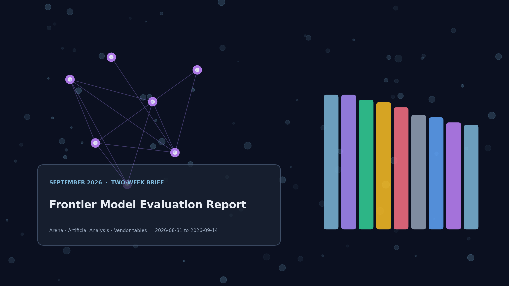

## 读数规则

| 标记 | 含义 |
| --- | --- |
| **I** | 独立同 harness（以 [Artificial Analysis](https://artificialanalysis.ai/) 为主） |
| **V** | 厂商自报 / 发布对照表，**不能当成跨厂官方排名** |
| 图中暖黄 | 中国实验室；冷蓝 | 美欧及其他 |

若见过 Index 57 / 61 / 66，那是 9 月更早刻度——**本文统一用 v4.3**（2026-09-07）。第三方综述：[IT Pro Expert · Sept 2026](https://itproexpert.com/which-ai-model-to-use-sept-2026/)。

---

## 1. 综合智力：一张表排完

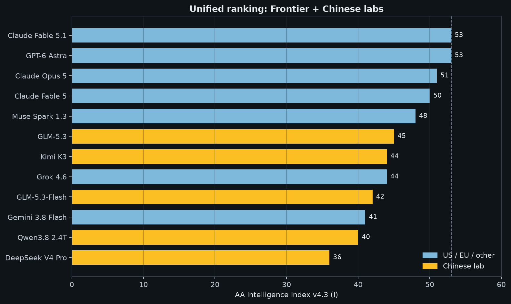

*来源：AA Intelligence Index v4.3（2026-09-07）· **I***

| 排名感 | 模型 | Index | 实验室 |
| --- | ---: | ---: | --- |
| 并列顶 | Claude Fable 5.1 (max+fallback) | **53** | Anthropic |
| 并列顶 | GPT-6 Astra (max) | **53** | OpenAI |
| 3 | Claude Opus 5 | 51 | Anthropic |
| 4 | Claude Fable 5 | 50 | Anthropic |
| 5 | Muse Spark 1.3 | 48 | Meta |
| **6** | **GLM-5.3** | **45** | 智谱 |
| **7** | **Kimi K3** | **44** | 月之暗面 |
| 7 | Grok 4.6 | 44 | xAI |
| **9** | **GLM-5.3-Flash** | **42** | 智谱 |
| 10 | Gemini 3.8 Flash | 41 | Google |
| **11** | **Qwen3.8 2.4T** | **40** | 阿里 |
| **12** | **DeepSeek V4 Pro** | **36** | DeepSeek |

同分 53 时任务成本差很大：Astra ≈ **\$3.26** / Index 任务，Fable ≈ **\$7.63**（AA 加权）。

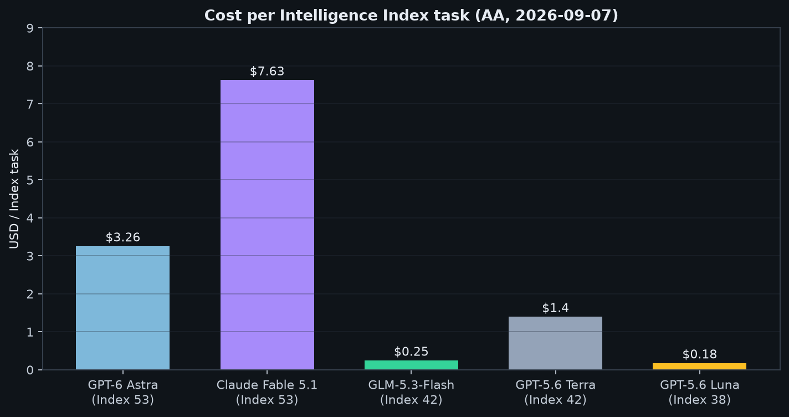

*中国开源侧的对照：GLM-5.3-Flash 在 Index **42** 时约 **\$0.25** / 任务，远低于同分段的 GPT-5.6 Terra（\$1.40）。*

---

## 2. 编程：美中同台

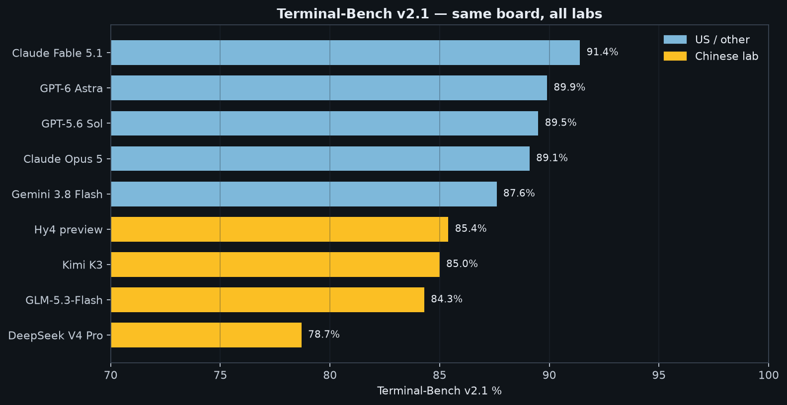

| 模型 | TB v2.1 | DeepSWE 1.1 **V** | 备注 |
| --- | ---: | ---: | --- |
| Claude Fable 5.1 | **91.4% I** | 67.4% | 简单终端榜第一档 |
| GPT-6 Astra | 89.9% I | **74.1%** | DeepSWE / TB v4.0 更强 |
| GPT-5.6 Sol | 89.5% I | 72.7% | |
| Claude Opus 5 | 89.1% I | 73.6% | |
| Gemini 3.8 Flash | 87.6% I | 73.8% | TB **v4.0** 厂商表仅 19.1% **V**，与 AA 难榜不可乱比 |
| **Hy4 preview** | **85.4%** | 64.3% | 腾讯；多语 SWE 表强 **V** |
| **Kimi K3** | **85.0% I** | **67.5%** | 与 GLM 常在 DeepSWE 中国侧领先 |
| **GLM-5.3-Flash** | 84.3% I | — | |
| **GLM-5.3** | — | 66.9% | AutomationBench-AA **62.2% I**（全球工作流前排） |
| **DeepSeek V4 Pro** | 78.7% I | 62.7% | 常引 SWE-bench Verified ~**80.6% V**（自托管叙事） |
| **Qwen3.8 Max** | — | 56.6% | 多语 SWE 可到 82.6% **V** 一带 |

**TB v4.0（更难，AA I）**：Astra **59.1%** > Fable **52.0%** > Opus **49.0%** > Sol **39.9%**。中国模型在此表公开完整同 harness 数字仍少——缺口本身也是信息。

编程专项互掐（Hy4 发布对照，多为 **V**）：

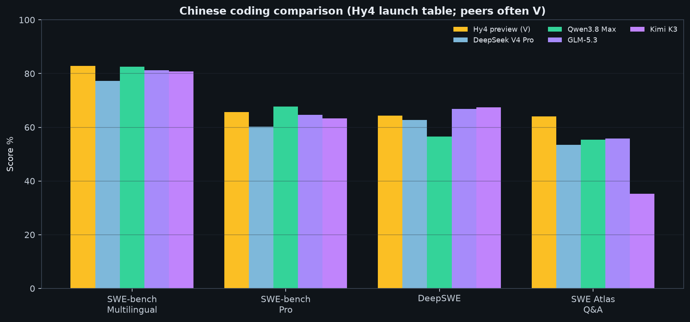

*Hy4 / DeepSeek / Qwen / GLM / Kimi 的 SWE 系对照；请当方向，不当最终判决。*

---

## 3. 科学与知识：也是一张板

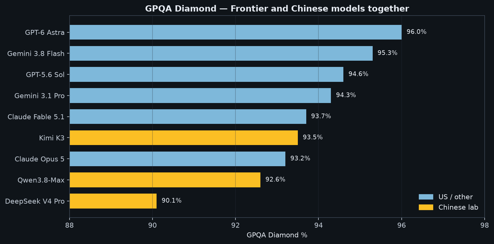

| 模型 | GPQA Diamond | HLE + tools **V** |
| --- | ---: | ---: |
| GPT-6 Astra | **96.0% V** | 57.2% |
| Gemini 3.8 Flash | 95.3% V | 54.9%（HLE-Verified 变体，近似） |
| GPT-5.6 Sol | 94.6% V | — |
| Claude Fable 5.1 | 93.7% V | **65.0%** |
| **Kimi K3** | **93.5% I** | — |
| Claude Opus 5 | 93.2% V | 63.6% |
| **Qwen3.8-Max** | **92.6% I** | — |
| **DeepSeek V4 Pro** | **90.1% I** | — |

**读法：** GPQA 上中美都挤在天花板；HLE 开工具仍是 Fable 明显领先 Astra 的一项。

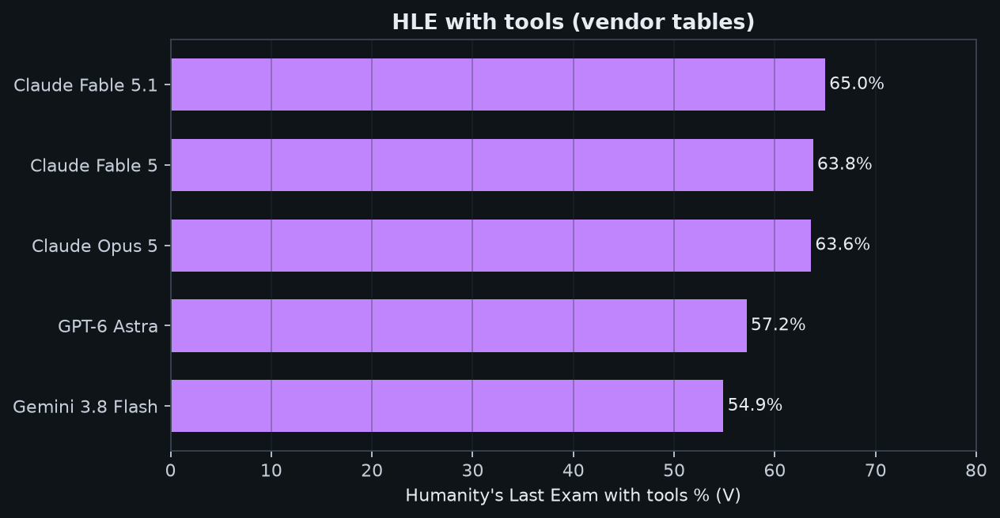

中文场景另有 [SuperCLUE](https://www.superclueai.com/)（约 9/10–11）：Qwen3.8-Max-0902 **72.62**、DeepSeek-V4.1-Flash **71.81**、GLM-5.3 **71.29**、Kimi-K3 **70.68**——五家差约 2 分，应与英文 Index **一起看**，而不是互相替代。

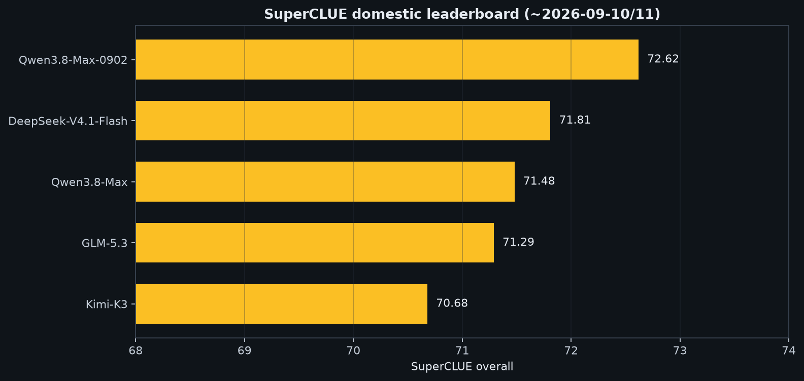

---

## 4. 计算机使用 / Agent

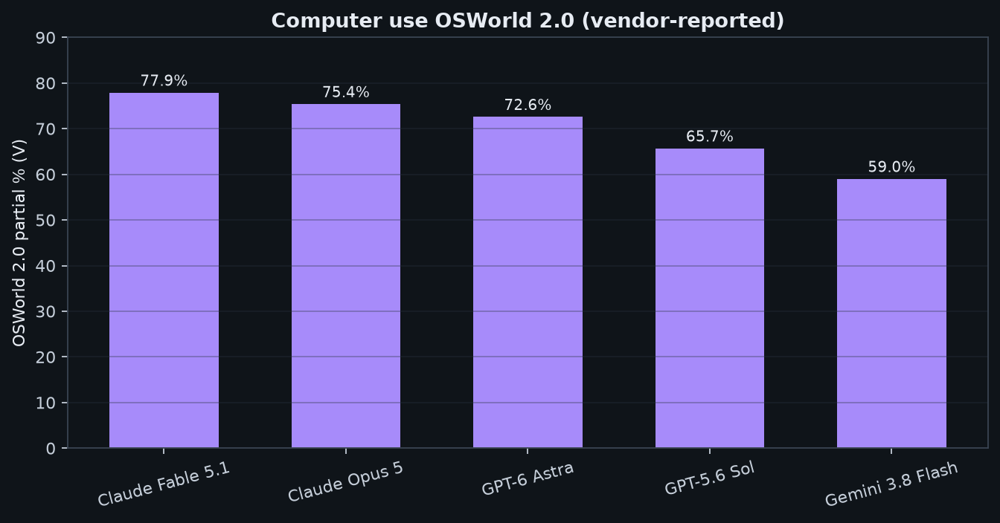

OSWorld 2.0 部分分 **V**：Fable 77.9 > Opus 75.4 > Astra 72.6 > Sol 65.7 > Gemini 3.8F 59.0。  
AutomationBench-AA **I**：Astra **68.5** > Grok 4.6 66.7 > **GLM-5.3 62.2**——**中国模型直接进全球 Agent 工作流前三叙事**。

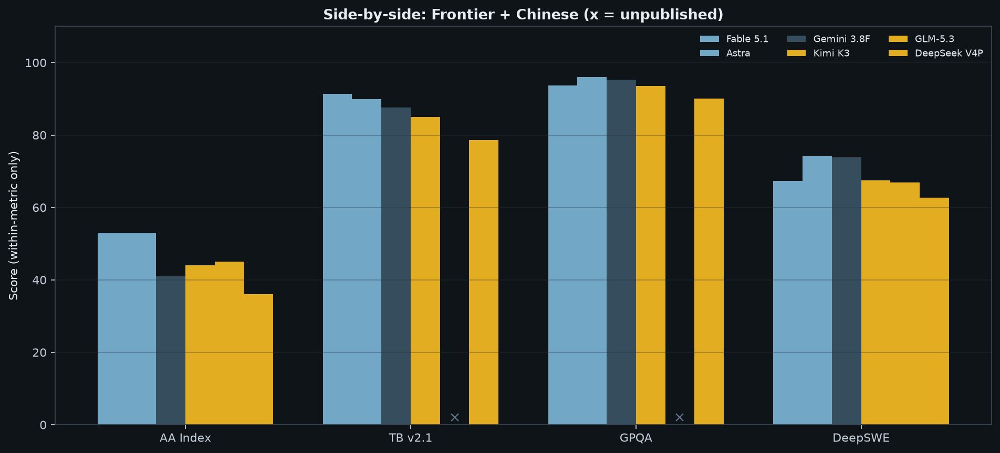

*`x` = 该格尚无公开同口径数字。*

---

## 5. 价格与用量：同一市场的两面

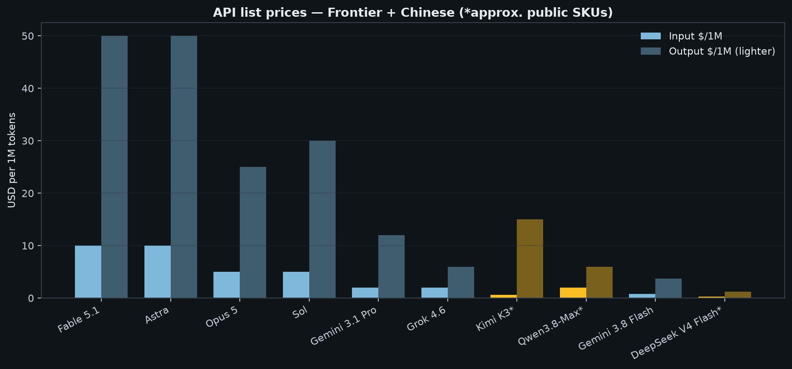

| 模型 | 输入/输出 \$/1M（公开档） | 角色 |
| --- | --- | --- |
| Fable 5.1 / Astra | 10 / 50 | 最难任务 |
| Opus 5 | 5 / 25 | 旗舰甜点 |
| Gemini 3.8 Flash | **0.75 / 3.75** | 近前沿 + 极速 |
| Qwen3.8-Max 等 | 约 2 / 6 量级 | 中文旗舰 API |
| Kimi K3 | 约 0.6 / 15 量级 | 长上下文贵在输出 |
| DeepSeek Flash 系 | 约 0.3 / 1.2 或更低 | 跑量与 Agent |

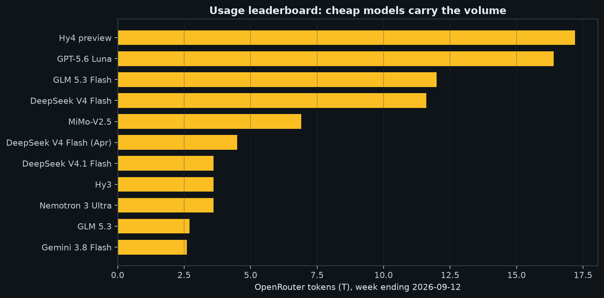

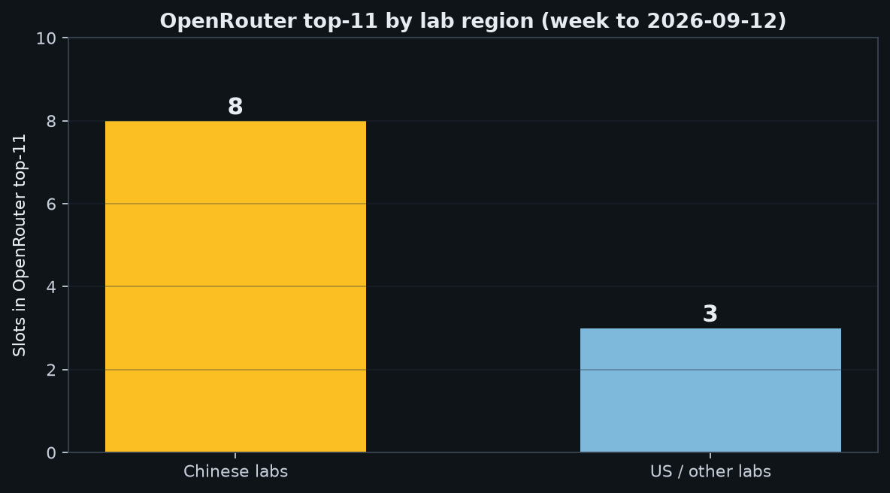

约至 2026-09-12 一周，OpenRouter top-11 里**中国实验室占多数席位**；Fable/Astra 几乎不在这份中立交易所用量榜（流量在自家 API）。  
**榜测天花板，用量测地板——大部分工作发生在地板。**

---

## 6. 总对照（请只做列内比较）

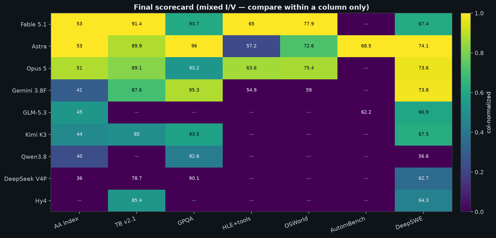

颜色是**该列内归一化**（越高越亮）；`—` 表示未见同口径公开分。混有 **I/V**，**禁止跨列比大小**。

| 维度 | 更占优的一侧（近两周公开数据） |
| --- | --- |
| 综合 Index | Fable = Astra；中国最高 GLM / Kimi 仍落后约 8–17 分 |
| 简单终端 TB v2.1 | Fable 微领先；Hy4 / Kimi / GLM-Flash 紧贴 Gemini |
| 难终端 TB v4.0 | Astra（中国完整同表较少） |
| GPQA | Astra / Gemini 略高；Kimi、Qwen 已在同一平台 |
| HLE+工具 | Fable |
| 桌面计算机使用 | Fable / Opus |
| 业务工作流 AutomBench | Astra；**GLM-5.3 进入前排** |
| DeepSWE | Astra / Gemini / Opus；中国侧 Kimi≈GLM≈Fable 同档互咬 |
| 中文通用 | Qwen / DeepSeek Flash / GLM / Kimi（SuperCLUE） |
| \$ / 任务与跑量 | Gemini Flash + 中国 Flash / 开源 API |

### 怎么选（不按国界）

| 任务 | 优先尝试 |
| --- | --- |
| 最难英文知识 / 长文研究 | Fable 5.1 或 Astra（同分看成本与工具链） |
| 数学 / 难终端 / 计算机使用 | 更偏 Astra |
| 批量近前沿编码 | Gemini 3.8 Flash |
| 中文产品默认 | Qwen 或 GLM；DeepSeek 做推理/代码侧车 |
| 自托管与合规 | DeepSeek / GLM / Qwen 权重 |
| 日用工程性价比 | Opus 5 + 任一中国 Flash 分流 |

用你自己的 **10 个真实任务**盲测，比任何公开榜准。

---

## 来源与局限

- [AA Index v4.3](https://artificialanalysis.ai/articles/artificial-analysis-intelligence-index-v4-3)（2026-09-07）  
- [AA Terminal-Bench v2.1](https://artificialanalysis.ai/evaluations/terminalbench-v2-1)  
- [IT Pro Expert Sept 2026](https://itproexpert.com/which-ai-model-to-use-sept-2026/)  
- [SuperCLUE](https://www.superclueai.com/)  
- LMArena 文本榜快照（约 9/1–9/2）  
- OpenAI / Anthropic / Google / 腾讯 Hy4 等发布材料（**V**）  

局限：窗口约两周；Index 刚换刻度；预览版（Hy4 等）会变；OpenRouter 不含各厂直连流量；部分中国模型缺 TB v4.0 / OSWorld 等同口径公开分。

## Bottom line

Over **2026-08-31 → 09-14**, Chinese labs and US/EU frontier models belong on **the same boards**:

- **AA Index v4.3**: Fable 5.1 and Astra **tie at 53**; best Chinese open scores land at GLM-5.3 **45** / Kimi **44**  
- **Coding**: TB v2.1 is crowded (78–91%) across regions; harder suites and DeepSWE separate them  
- **GPQA**: Kimi / Qwen sit in the same 90+ band as Fable  
- **Usage**: cheap Chinese SKUs dominate OpenRouter volume; frontier flagships barely appear there  

**No universal winner.** Pick by task, not by passport.

## Reading rules

| Tag | Meaning |
| --- | --- |
| **I** | Independent same-harness ([Artificial Analysis](https://artificialanalysis.ai/)) |
| **V** | Vendor tables — not a cross-lab ranking |
| Warm amber in charts | Chinese lab; cool blue | others |

Use **Index v4.3 only**. Synthesis: [IT Pro Expert · Sept 2026](https://itproexpert.com/which-ai-model-to-use-sept-2026/).

---

## 1. Intelligence — one ranking

Fable = Astra at **53**. Then Opus 51 … Muse 48 … **GLM-5.3 45**, **Kimi 44**, Grok 44, **GLM-Flash 42**, Gemini 3.8 Flash 41, **Qwen3.8 40**, **DeepSeek V4 Pro 36**.

Same Index, different bill: Astra ≈ **\$3.26** / task vs Fable ≈ **\$7.63**. GLM-Flash ≈ **\$0.25** at Index 42.

---

## 2. Coding — same stage

Fable **91.4% I** leads TB v2.1; Hy4 / Kimi / GLM-Flash sit just under Gemini. Astra leads many **DeepSWE** and **TB v4.0** cells (**59.1% I**). DeepSeek keeps the self-host SWE-bench Verified ~**80.6% V** narrative. Qwen/Hy4 look strong on multilingual SWE (**V**).

---

## 3. Science & knowledge

Astra / Gemini edge GPQA; **Kimi 93.5** and **Qwen 92.6** share the platform. HLE+tools still favors Fable (**65.0% V**) over Astra (**57.2% V**).

For Chinese-language product work, also read [SuperCLUE](https://www.superclueai.com/) (~Sep 10–11): Qwen-Max-0902 **72.62**, DeepSeek-V4.1-Flash **71.81**, GLM-5.3 **71.29**, Kimi **70.68**.

---

## 4. Computer use / agents

OSWorld partial **V**: Fable > Opus > Astra. AutomationBench-AA **I**: Astra **68.5**, then Grok, then **GLM-5.3 62.2**.

---

## 5. Price & usage

Benchmarks = ceiling. Usage = floor. Most work happens on the floor—often Chinese Flash/open APIs.

---

## 6. Final scorecard (column-only)

Colors are **within-column** normalized. `—` = no same-harness public number. Mixed **I/V** — do not compare across columns.

| Dimension | Who looks stronger in this window |
| --- | --- |
| Composite Index | Fable = Astra; top Chinese still −8 to −17 |
| TB v2.1 | Fable slight lead; Hy4/Kimi/GLM-Flash near Gemini |
| TB v4.0 | Astra (sparse Chinese same-harness numbers) |
| GPQA | Astra/Gemini edge; Kimi/Qwen on the same plateau |
| HLE+tools | Fable |
| OSWorld | Fable / Opus |
| AutomBench | Astra; **GLM-5.3 in the lead pack** |
| DeepSWE | Astra / Gemini / Opus; CN peers cluster with Fable |
| Chinese general | Qwen / DeepSeek Flash / GLM / Kimi |
| \$ / volume | Gemini Flash + Chinese Flash/open APIs |

### Picks (not by country)

| Need | Try first |
| --- | --- |
| Hardest English research | Fable or Astra |
| Math / hard terminal / computer use | Astra-leaning |
| Bulk near-frontier coding | Gemini 3.8 Flash |
| Chinese product default | Qwen or GLM; DeepSeek as sidecar |
| Self-host | DeepSeek / GLM / Qwen weights |
| Daily eng value | Opus 5 + a Chinese Flash |

Run a **10-task bake-off on your own work**.

---

## Sources & limits

- [AA Index v4.3](https://artificialanalysis.ai/articles/artificial-analysis-intelligence-index-v4-3)  
- [AA TB v2.1](https://artificialanalysis.ai/evaluations/terminalbench-v2-1)  
- [IT Pro Expert Sept 2026](https://itproexpert.com/which-ai-model-to-use-sept-2026/)  
- [SuperCLUE](https://www.superclueai.com/)  
- LMArena snapshots; vendor tables (**V**) including Hy4  

Limits: ~two weeks; Index rebase; preview scores move; OpenRouter excludes first-party traffic; some Chinese models lack TB v4.0 / OSWorld public same-harness scores.

