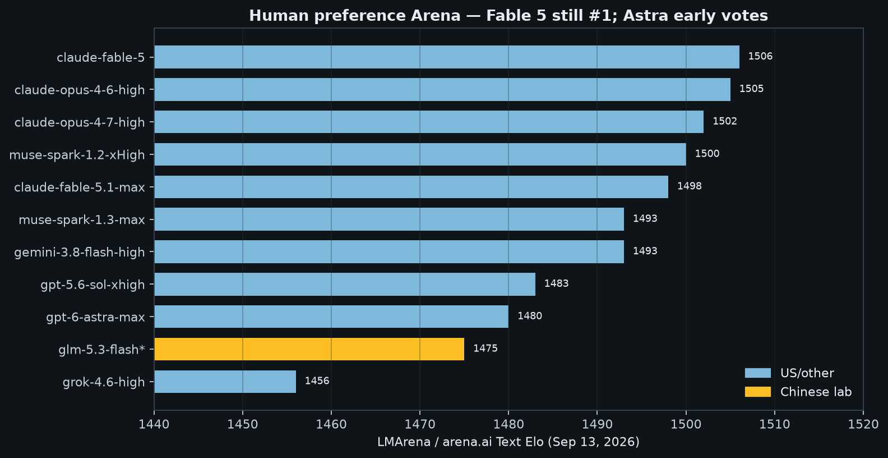
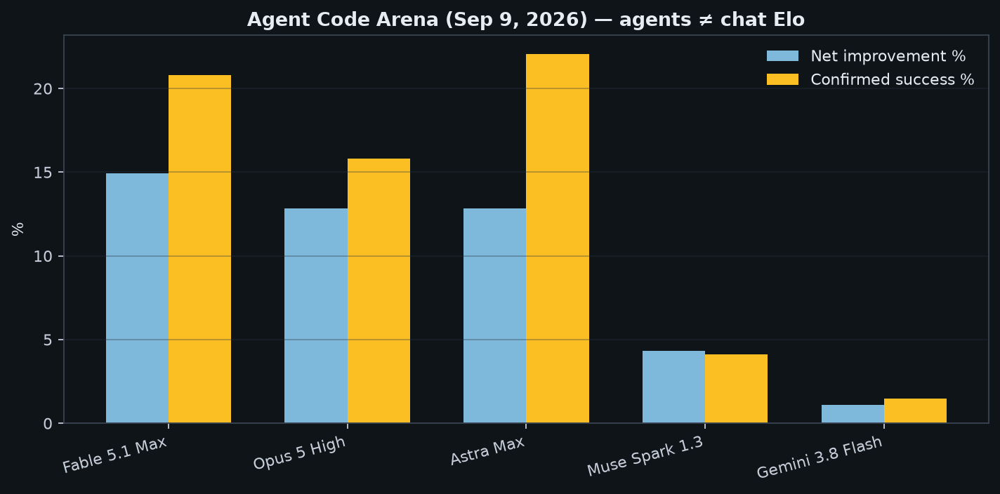
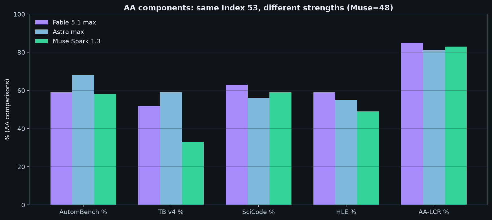
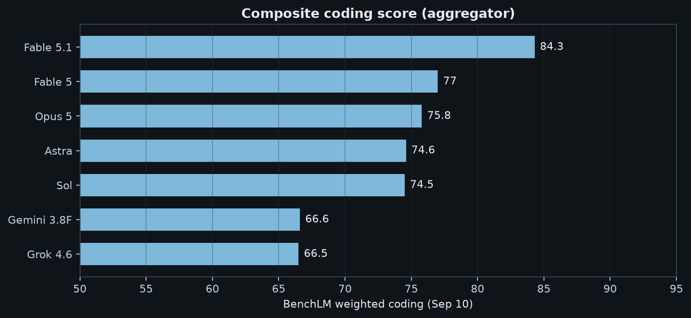

## 结论先说

近两周（约 **2026-08-31 → 09-14**）不是「美国旗舰换代、中国另开一桌」，而是**同一批基准上一起打**：

- **聊天 Arena**：Fable 5 仍以 **1506** Elo 居首；Fable 5.1 / Astra 的 **Agent** 表现是另一张榜  
- **综合智力（AA Index v4.3）**：Fable 5.1 与 Astra **并列 53**；中国侧 GLM-5.3 **45**、Kimi **44**  
- **编程**：TB v2.1 美中挤在 78–91%；TB v4 / DeepSWE / Agent Code 才拉开  
- **GPQA**：Kimi / Qwen 已与 Fable 同处 90+ 带  
- **真实用量**：OpenRouter 上中国廉价档吃掉大部分 token  

**没有全能冠军。** 选型看任务，不看国籍。

## 读数规则

| 标记 | 含义 |
| --- | --- |
| **I** | 独立同 harness（[Artificial Analysis](https://artificialanalysis.ai/)、[arena.ai](https://arena.ai/) 等） |
| **V** | 厂商自报，**不能当成跨厂官方排名** |
| 图中暖黄 | 中国实验室；冷蓝 | 美欧及其他 |

若见过 Index 57 / 61 / 66，或 OpenAI 表上的 **v4.1.1（Astra 61.2 / Fable 65.7）**，那是 **v4.3 换刻度之前**的分数——**不可与本文的 53 分封顶混画在同一轴**。综述：[IT Pro Expert · Sept 2026](https://itproexpert.com/which-ai-model-to-use-sept-2026/)。

---

## 1. 人类偏好 Arena ≠ Agent 榜

*来源：[arena.ai Text](https://arena.ai/leaderboard/text/) · **2026-09-13** · 众包偏好*

| 模型 | Elo | 备注 |
| --- | ---: | --- |
| **claude-fable-5** | **1506** | 总榜仍 #1 |
| claude-opus-4-6-high | 1505 | |
| **claude-fable-5.1-max** | **1498** | 新锐，尚未超过 Fable 5 |
| gemini-3.8-flash-high | 1493 Prel. | |
| muse-spark-1.3-max | 1493 | |
| gpt-5.6-sol-xhigh | 1483 | |
| **gpt-6-astra-max** | **1480±12** | 票少、区间宽 |
| **glm-5.3-flash** | ~1475 | 中国 Flash 进主榜中段 |
| grok-4.6-high | 1456 | 发布偏窗外（8/12） |

*来源：[arena.ai Agent Code](https://arena.ai/leaderboard/agent/code/) · **2026-09-09***

| 模型 | Net improvement | Confirmed success | 成本 P50 |
| --- | ---: | ---: | ---: |
| **Fable 5.1 Max** | **14.92%** | 20.80% | $11.80 |
| Opus 5 High | 12.84% | 15.82% | $5.54 |
| **Astra Max** | **12.84%** | **22.07%**（最高） | $10.32 |
| Muse Spark 1.3 | 4.32% | 4.10% | $0.69 |
| Gemini 3.8 Flash | 1.11% | 1.48% | — |

**一句话：** 文本 Arena 宠 Fable 5；Agent 编码宠 Fable 5.1；Astra 聊天 Elo 还早，但 Agent 已进前三。

---

## 2. 综合智力：一张表排完

*来源：AA Intelligence Index **v4.3**（2026-09-07）· **I***

| 排名感 | 模型 | Index | 实验室 |
| --- | ---: | ---: | --- |
| 并列顶 | Claude Fable 5.1 (max+fallback) | **53** | Anthropic |
| 并列顶 | GPT-6 Astra (max) | **53** | OpenAI |
| 3 | Claude Opus 5 | 51 | Anthropic |
| 4 | Claude Fable 5 | 50 | Anthropic |
| 5 | Muse Spark 1.3 | 48 | Meta |
| **6** | **GLM-5.3** | **45** | 智谱 |
| **7** | **Kimi K3** | **44** | 月之暗面 |
| 7 | Grok 4.6 | 44 | xAI |
| **9** | **GLM-5.3-Flash** | **42** | 智谱 |
| 10 | Gemini 3.8 Flash | 41 | Google |
| **11** | **Qwen3.8 2.4T** | **40** | 阿里 |
| **12** | **DeepSeek V4 Pro** | **36** | DeepSeek |

同分 53，分项并不一样：

*Fable：Briefcase / SciCode / HLE / LCR 更强；Astra：Automation / TB v4 更强；Muse（48）用速度换综合分。*

任务成本：Astra ≈ **$3.26** / Index 任务，Fable ≈ **$7.63**；GLM-5.3-Flash 在 Index 42 时约 **$0.25**（对比同分段 GPT-5.6 Terra **$1.40**）。

---

## 3. 编程：美中同台

| 模型 | TB v2.1 | DeepSWE 1.1 **V** | 备注 |
| --- | ---: | ---: | --- |
| Claude Fable 5.1 | **91.4% I** | 67.4% | |
| GPT-6 Astra | 89.9% I | **74.1%** | TB v4.0 **59.1% I**（厂商 †57.9%） |
| GPT-5.6 Sol | 89.5% I | 72.7% | TB v4 **39.9% I** |
| Claude Opus 5 | 89.1% I | 73.6% | Steel SWE-Verified **97%**（Vals，9 月） |
| Gemini 3.8 Flash | 87.6% I | 73.8% | TB v4 厂商表 19.1% **V**，勿与 AA 乱比 |
| **Hy4 preview** | **85.4%** | 64.3% | 多语 SWE 强 **V** |
| **Kimi K3** | **85.0% I** | **67.5%** | |
| **GLM-5.3-Flash** | 84.3% I | — | |
| **GLM-5.3** | — | 66.9% | AutomBench-AA **62.2% I** |
| **DeepSeek V4 Pro** | 78.7% I | 62.7% | SWE-Verified ~**80.6% V** 自托管叙事 |
| **Qwen3.8 Max** | — | 56.6% | 多语 SWE ~82.6% **V** |

TB v4.0（AA I）：Astra **59.1%** > Fable **52.0%**（厂商 †55.8%）> Opus **49.0%**。中国模型完整同 harness 公开分仍少。

* [BenchLM coding](https://benchlm.ai/coding) · 9/10：Fable 5.1 **84.3** > Fable 5 77 > Opus 75.8 > Astra 74.6。LiveCodeBench v6 榜首多为 Sakana / Solar / **Qwen3.8-Flash-Next 91.9%**；Fable 5.1、Astra 基本未上这张快照。AIME 已饱和；Aider 停在 2025-11，不适用本窗口。*

---

## 4. 科学与知识

| 模型 | GPQA Diamond | HLE + tools **V** |
| --- | ---: | ---: |
| GPT-6 Astra | **96.0–96.1%** | 57.2% |
| Gemini 3.8 Flash | 95.3% | 54.9%（HLE-Verified 近似） |
| Claude Fable 5.1 | 93.7% | **65.0%**（无工具 60.9%） |
| **Kimi K3** | **93.5%** | — |
| Claude Opus 5 | 93.2% | 63.6% |
| **Qwen3.8-Max** | **92.6%** | — |
| **DeepSeek V4 Pro** | **90.1%** | — |

中文场景另看 [SuperCLUE](https://www.superclueai.com/)（约 9/10–11）：Qwen3.8-Max-0902 **72.62**、DeepSeek-V4.1-Flash **71.81**、GLM-5.3 **71.29**、Kimi-K3 **70.68**——与英文 Index **一起看**，不互相替代。

---

## 5. 计算机使用 / Agent

OSWorld 2.0 部分分 **V**：Fable 77.9 > Opus 75.4 > Astra 72.6。AutomBench-AA **I**：Astra **68.5** > Grok 66.7 > **GLM-5.3 62.2**。

---

## 6. 价格与用量

约至 9/12 一周，OpenRouter top-11 中国实验室占多数席；Fable/Astra 几乎不在（流量在自家 API）。**榜测天花板，用量测地板。**

---

## 7. 总对照（只做列内比较）

| 维度 | 更占优的一侧（近两周公开数据） |
| --- | --- |
| 文本 Arena Elo | **Fable 5**；Fable 5.1 紧追；Astra 票少暂居中游 |
| Agent Code Arena | **Fable 5.1**；Astra 成功率最高之一 |
| 综合 Index | Fable = Astra；中国最高仍落后约 8–17 分 |
| TB v2.1 | Fable 微领先；Hy4 / Kimi / GLM-Flash 紧贴 Gemini |
| TB v4.0 | Astra（中国同口径公开分少） |
| GPQA | Astra / Gemini 略高；Kimi、Qwen 同一平台 |
| HLE+工具 | Fable |
| OSWorld | Fable / Opus |
| AutomBench | Astra；**GLM-5.3 进前排** |
| DeepSWE | Astra / Gemini / Opus；中国侧与 Fable 同档互咬 |
| 中文通用 | Qwen / DeepSeek Flash / GLM / Kimi |
| 跑量与单价 | Gemini Flash + 中国 Flash / 开源 API |

| 任务 | 优先尝试 |
| --- | --- |
| 最难英文研究 | Fable 5.1 或 Astra |
| 数学 / 难终端 / 计算机使用 | 更偏 Astra |
| 批量近前沿编码 | Gemini 3.8 Flash |
| 中文产品默认 | Qwen 或 GLM；DeepSeek 做侧车 |
| 自托管 | DeepSeek / GLM / Qwen 权重 |
| 日用工程性价比 | Opus 5 + 中国 Flash 分流 |

用你自己的 **10 个真实任务**盲测。

---

## 来源与局限

- [arena.ai Text](https://arena.ai/leaderboard/text/)（9/13）、[Agent Code](https://arena.ai/leaderboard/agent/code/)（9/9）  
- [AA Index v4.3](https://artificialanalysis.ai/articles/artificial-analysis-intelligence-index-v4-3)、[comparisons](https://artificialanalysis.ai/models/comparisons)  
- [BenchLM](https://benchlm.ai/coding)、[LiveCodeBench v6](https://benchlm.ai/benchmarks/livecodebench-v6)、[Steel SWE-Verified](https://leaderboard.steel.dev/leaderboards/swe-bench-verified/)  
- [IT Pro Expert](https://itproexpert.com/which-ai-model-to-use-sept-2026/)、[SuperCLUE](https://www.superclueai.com/)  
- [Astra](https://openai.com/index/gpt-6-astra/)、[Fable 5.1](https://www.anthropic.com/claude-fable-and-mythos-5-1)、Gemini 3.8、Hy4（**V**）  

局限：约两周窗口；Index 换刻度；预览分会变；OpenRouter 不含直连流量；部分中国模型缺 TB v4 / OSWorld 同口径公开分。

## Bottom line

Over **2026-08-31 → 09-14**, Chinese and frontier labs belong on **one board**:

- **Text Arena**: Fable 5 still **1506**; Agent Code crowns **Fable 5.1**; Astra is already top-tier on agents  
- **AA Index v4.3**: Fable 5.1 and Astra **tie at 53**; GLM-5.3 **45** / Kimi **44**  
- **Coding**: TB v2.1 crowded; TB v4 / DeepSWE / Agent Code separate them  
- **GPQA**: Kimi / Qwen share the 90+ band with Fable  
- **Usage**: cheap Chinese SKUs dominate OpenRouter volume  

**No universal winner.** Pick by task, not passport.

## Reading rules

| Tag | Meaning |
| --- | --- |
| **I** | Independent same-harness (AA, arena.ai, …) |
| **V** | Vendor tables |
| Warm amber | Chinese lab; cool blue | others |

**Index v4.3 only.** OpenAI’s **v4.1.1** numbers (Astra 61.2 / Fable 65.7) are the **pre-rebase** scale. Synthesis: [IT Pro Expert](https://itproexpert.com/which-ai-model-to-use-sept-2026/).

---

## 1. Chat Arena ≠ Agent Arena

[arena.ai Text](https://arena.ai/leaderboard/text/) · **Sep 13** — Fable 5 **1506**; Fable 5.1-max **1498**; Astra-max **1480±12**; GLM-5.3-Flash ~**1475**.

[arena.ai Agent Code](https://arena.ai/leaderboard/agent/code/) · **Sep 9** — Fable 5.1 **14.92%** net; Astra **12.84%** net with **best confirmed success 22.07%**.

---

## 2. Intelligence — one ranking

Fable = Astra at **53**. GLM-5.3 **45**, Kimi **44**, GLM-Flash **42**, Qwen3.8 **40**, DeepSeek V4 Pro **36**.

Cost: Astra ≈ **$3.26**/task vs Fable ≈ **$7.63**; GLM-Flash ≈ **$0.25** at Index 42.

---

## 3. Coding — same stage

Fable **91.4% I** on TB v2.1; Hy4/Kimi/GLM-Flash near Gemini. Astra leads TB v4 (**59.1% I**) and many DeepSWE cells. Opus 5 hits Steel SWE-Verified **97%** (Vals); Fable 5.1/Astra Verified rows still sparse (Sep 4). LiveCodeBench v6 favors Sakana/Solar/**Qwen3.8-Flash-Next 91.9%**. AIME saturated; Aider stale (2025-11).

---

## 4. Science & knowledge

---

## 5. Computer use / agents

AutomBench-AA: Astra **68.5**, **GLM-5.3 62.2**.

---

## 6. Price & usage

---

## 7. Final scorecard (column-only)

| Dimension | Stronger in this window |
| --- | --- |
| Text Arena | **Fable 5** |
| Agent Code | **Fable 5.1**; Astra top success |
| Index | Fable = Astra; CN −8…−17 |
| TB v2.1 | Fable; Hy4/Kimi/GLM-Flash near Gemini |
| TB v4 | Astra |
| GPQA | Astra/Gemini edge; Kimi/Qwen on plateau |
| HLE+tools | Fable |
| AutomBench | Astra; **GLM-5.3 in pack** |
| Chinese general | Qwen / DeepSeek Flash / GLM / Kimi |
| Volume / $ | Gemini Flash + Chinese Flash/open |

| Need | Try |
| --- | --- |
| Hardest English research | Fable or Astra |
| Math / hard terminal / computer use | Astra-leaning |
| Bulk coding | Gemini 3.8 Flash |
| Chinese product | Qwen or GLM; DeepSeek sidecar |
| Self-host | DeepSeek / GLM / Qwen |
| Daily eng value | Opus 5 + Chinese Flash |

Run a **10-task bake-off**.

---

## Sources & limits

- [arena.ai Text](https://arena.ai/leaderboard/text/), [Agent Code](https://arena.ai/leaderboard/agent/code/)  
- [AA v4.3](https://artificialanalysis.ai/articles/artificial-analysis-intelligence-index-v4-3), [comparisons](https://artificialanalysis.ai/models/comparisons)  
- [BenchLM](https://benchlm.ai/coding), [LCB v6](https://benchlm.ai/benchmarks/livecodebench-v6), [Steel SWE](https://leaderboard.steel.dev/leaderboards/swe-bench-verified/)  
- [IT Pro](https://itproexpert.com/which-ai-model-to-use-sept-2026/), [SuperCLUE](https://www.superclueai.com/)  
- [Astra](https://openai.com/index/gpt-6-astra/), [Fable 5.1](https://www.anthropic.com/claude-fable-and-mythos-5-1), Gemini 3.8, Hy4 (**V**)  

Limits: ~two weeks; Index rebase; previews move; OpenRouter excludes first-party traffic; sparse CN TB v4 / OSWorld same-harness rows.

