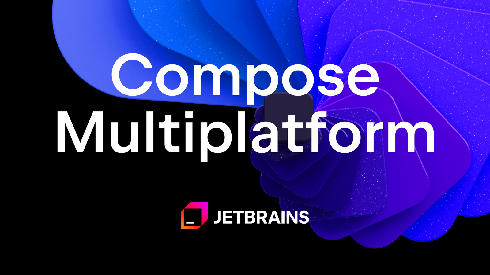
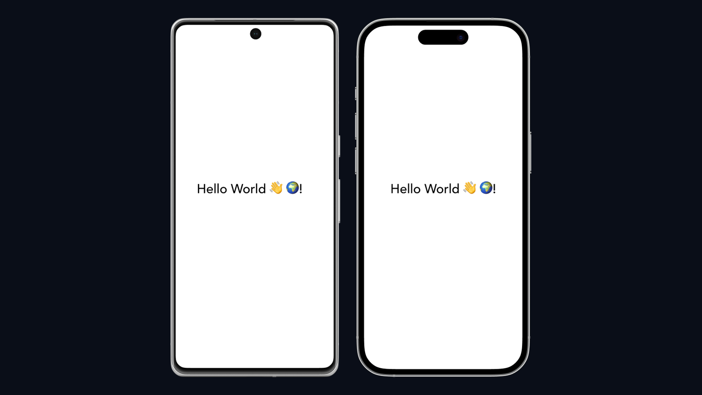

<div data-post-lang="zh">

## 为什么要三方一起比

选跨平台时，只拿 Flutter 对 Compose Multiplatform 会漏掉市场上份额最大的那一档：**React Native（RN）**。互联网公司招人、买外包、看竞品源码，这三套会反复撞车。

本文按同一套尺子量三者：

1. 它到底画 UI 的方式是什么  
2. 语言与团队技能是否匹配  
3. 双端（再加桌面 / Web）成熟到哪一步  
4. 和原生代码怎么共存  
5. **行业里谁在用、用在哪一层**  
6. 从零到能交货的学习路径  

案例只写有公开材料可核对的（官方 Showcase / 工程博客）。App 很少「100% 某一框架」——常见是核心链路跨平台、相机/支付/性能页仍走原生。



*来源：[Compose Multiplatform](https://kotlinlang.org/compose-multiplatform/)*

## 一句话定位

| | Compose Multiplatform | Flutter | React Native |
| --- | --- | --- | --- |
| 出品 | JetBrains（Android 目标接 Google Jetpack Compose） | Google | Meta（社区 + 微软 / Amazon / Shopify 等共建） |
| 语言 | Kotlin | Dart | JavaScript / TypeScript |
| UI 模型 | `@Composable` 函数 | `Widget` 树 | React 组件（`View` / `Text` 映射原生） |
| 怎么画到屏幕 | 按目标选：Android 用 Compose 工件；其它端 Skia / 原生控件组合 | **自绘引擎**（Impeller / Skia），像素强一致 | **原生控件**（Yoga 布局 + 新架构 Fabric/TurboModules） |
| 典型交付面 | Android 最稳，iOS / Desktop / Web 在追 | Android、iOS、Web、Desktop、嵌入式 | Android、iOS 为主；Web 用 React；桌面有社区方案 |
| 和 Web 前端的关系 | 弱（除非已有 Kotlin） | 弱（Dart） | **强**：React 技能几乎直接搬 |

记住两对易混概念：

- **Jetpack Compose ≠ CMP**：前者主战场是 Android；后者是 JetBrains 把 Compose 模型扩到多端。Android 上 CMP 会用到 Google 发布的 Compose 依赖。[官方关系说明](https://kotlinlang.org/docs/multiplatform/compose-multiplatform-and-jetpack-compose.html)  
- **React ≠ React Native**：Web 上的 React 画 DOM；RN 把同一套组件模型接到系统控件。Expo 是目前官方推荐的「带路由、更新、原生模块」的应用框架，而不是另一套 UI 引擎。


*来源：[Wikimedia Commons — Flutter logo](https://commons.wikimedia.org/wiki/File:Google-flutter-logo.svg)*



*来源：[reactnative.dev](https://reactnative.dev/)*

## 完整对照表（选型时真正会问的问题）

| 维度 | CMP | Flutter | React Native |
| --- | --- | --- | --- |
| 学习曲线（已有技能） | 会 Kotlin / Compose → 很陡的优势 | 几乎总要先交 Dart 税 | 会 React / TS → 最快上手 |
| UI 一致性 | 中：Android 原生感强，跨端要自己约束 | **高**：自绘，设计师出一稿较省心 | 中：跟系统控件走，双端「像各自系统」 |
| 性能上限 | Android 接近原生；其它端看版本与图形层 | 动画 / 自绘场景很强；大列表要会 Isolate、Impeller 坑 | 新架构后 JS 与原生边界更短；仍要避开无谓桥接 |
| 热重载 | Compose 预览 + 热重载在桌面/Android 体验好 | **最成熟**的 Stateful Hot Reload | Fast Refresh 成熟；改原生模块仍要编译 |
| 原生互操作 | KMP `expect/actual`、直接调 Android/iOS API 自然 | Platform Channel / FFI / 插件 | Native Modules；Expo 模块或写原生胶水 |
| 包体积 | 通常小于带引擎的方案 | 引擎进包，Hello World 就更胖 | 介于两者；Hermes 有帮助 |
| 生态体量 | 最小，但 Kotlin 库可复用 | 大，pub.dev 插件全 | **最大招聘盘**，npm 海量，质量参差 |
| 招聘 / 外包 | 「会 CMP」岗位仍少，Kotlin 岗可转化 | Flutter 岗明确、外包报价透明 | RN / React 岗最多，人员最好找 |
| Web | CMP Web 在推进，生产要评估 | Flutter Web 适合内部工具、嵌入，SEO/包体要谨慎 | 产品 Web 往往直接 **React**，不必 RN Web |
| Desktop | JetBrains 自己吃狗粮，工具类合适 | 官方支持 Windows/macOS/Linux | 非一等公民（有社区 / 微软投入，但不是默认） |
| 渐进接入已有 App | **很适合**：一块屏幕、一个 Feature 模块迁 | 可以 add-to-app，工程较重 | **很适合**：Facebook 自己就是这样长出来的 |
| 状态管理习惯 | Compose 运行时 + ViewModel / 协程 | Provider / Riverpod / Bloc / GetX | Redux / Zustand / Jotai / TanStack Query |
| 类型与空安全 | Kotlin 空安全是一等公民 | Dart 空安全成熟 | TS 可选；纪律差就会「any 满天飞」 |
| 风险点 | iOS/Web 成熟度、示例少 | Dart 孤岛、大厂战略波动焦虑 | 历史「桥」性能阴影、依赖链安全 |

没有一列是「全面碾压」。差的是**你已有的人、已有的代码、要上的端**。

## 代码手感：同一交互三写法

都是「一个按钮，点一下计数 +1」。看的是心智，不是完整工程。

### Compose Multiplatform（Kotlin）

```kotlin
@Composable
fun Counter() {
    var count by remember { mutableStateOf(0) }
    Button(onClick = { count++ }) {
        Text("Clicked $count")
    }
}
```

重组（recomposition）驱动界面。Android 同事几乎不用换脑子。共享逻辑放 `commonMain`，用协程打网络。

### Flutter（Dart）

```dart
class Counter extends StatefulWidget {
  const Counter({super.key});
  @override
  State<Counter> createState() => _CounterState();
}

class _CounterState extends State<Counter> {
  int count = 0;
  @override
  Widget build(BuildContext context) {
    return ElevatedButton(
      onPressed: () => setState(() => count++),
      child: Text('Clicked $count'),
    );
  }
}
```

一切皆 Widget。复杂产品很少停在 `setState`，会上 Riverpod / Bloc。逻辑共享 = Dart 包。

### React Native（TypeScript）

```tsx
export function Counter() {
  const [count, setCount] = useState(0)
  return (
    <Pressable onPress={() => setCount((c) => c + 1)}>
      <Text>Clicked {count}</Text>
    </Pressable>
  )
}
```

和写 Web React 几乎同一套 Hook。导航常用 Expo Router；列表用 FlashList；网络用 fetch / TanStack Query。原生能力不够就加 Expo 模块或自写 Turbo Module。

## 架构差异（决定你后期有多痛）

**Flutter** 把 UI 画在自己的引擎上，和系统控件是「邻居」不是「同屋」。好处是双端长得像；坏处是系统级能力（小组件、部分无障碍、平台特有控件）要绕路。

**React Native** 走「用 JS 描述树 → 映射到平台 View」。旧架构的 Bridge 异步是早期性能槽点；[新架构](https://reactnative.dev/docs/the-new-architecture/landing-page)（JSI / Fabric / TurboModules）把这个边界收短了。2024 之后新项目应默认新架构。

**CMP / KMP** 更像「共享 Kotlin 世界」。Android 上你就是在写 Jetpack Compose；iOS 上 UI 可用 Compose 或仍用 SwiftUI，业务层 Kotlin 共享。适合已经有 Android 主力团队、不想养第二门 UI 语言的公司。

## 行业案例：谁在用、用在哪

下列来自官方 Showcase 或公司工程博客。**不是**「整个 App 每一行都是该框架」——请把它理解成「至少有大规模生产流量跑在这套栈上」。

### Flutter 典型

公开页：[flutter.dev/showcase](https://flutter.dev/showcase)

| 产品 | 行业 | 为何常被提起 |
| --- | --- | --- |
| [Google Pay](https://flutter.dev/showcase/google-pay) | 支付 / 超级 App 能力 | 谷歌自己的产品线背书；金融合规场景也能上 |
| [BMW](https://flutter.dev/showcase/bmw) | 汽车 | 车机 + 手机配套，强调设计一致与多区域交付 |
| [Nubank](https://flutter.dev/showcase/nubank) | 数字银行 | 拉美体量级金融 App，迭代速度要求高 |
| 阿里闲鱼 等（历史/区域案例） | 电商 / C2C | 国内很早的大规模实践，中文社区常引 |
| eBay Motors、Philips、Reflectly、Superlist 等 | 垂直电商、IoT、消费工具 | 展示「非 Demo」的设计密集界面 |

**适合对标的公司形态**：要强视觉一致性、设计师出一稿、双端（甚至桌面）同一套像素；团队能接受 Dart。

### React Native 典型

公开页：[reactnative.dev/showcase](https://reactnative.dev/showcase)，首页也点名 Amazon、Bloomberg 等。

| 产品 | 行业 | 为何常被提起 |
| --- | --- | --- |
| Instagram / Facebook / Ads Manager | 社交 / 广告 | Meta 自己养的框架；典型「巨型 App 里渐进插入 RN」 |
| Shopify | 电商基础设施 | 大量商家端、内部工具；对 TS 与 Web 同源要求高 |
| Bloomberg | 财经资讯 | 信息流 + 图表，早期 RN 标杆之一 |
| Amazon Shopping / Alexa 相关客户端 | 电商 / 智能硬件 | 官方 Showcase 出现，说明零售巨头也在用 |
| Microsoft（Office、Xbox、Skype 等产品线中的 RN 部分） | 生产力 / 娱乐 | 证明 RN 能进「桌面+移动」大厂工具链 |
| Discord、Pinterest、Coinbase、Walmart、Tesla App 等 | 社交、社区、金融、零售、汽车 | 社区常引用；**部分产品后续有模块迁出或混用**，选型时要查近两年博文，不要当永久标签 |

**适合对标的公司形态**：已有 React Web 中台、希望移动端复用人与组件心智；或巨型 App 要一块一块替换原生。

### Compose Multiplatform / Kotlin Multiplatform 典型

KMP 案例集中在 [kotlinlang.org 的 Multiplatform](https://kotlinlang.org/lp/multiplatform/) 与 KotlinConf 演讲。CMP 比「纯 KMP 共享逻辑」更年轻，很多大厂是 **KMP 共享 domain + 各端原生 UI**，UI 再逐步 Compose 化。

| 产品 / 团队 | 行业 | 实际用法（注意分层） |
| --- | --- | --- |
| McDonald's | 餐饮零售 | 公开分享用 KMP 共享业务逻辑，降低双端重复 |
| Cash App（Block） | 金融 | Kotlin 重度，共享层服务双端 |
| Forbes | 媒体 | KMP 降双端资讯客户端成本 |
| 9GAG 等社区产品 | 社区 | Showcase 常客，中小型内容 App 样本 |
| 若干车企 / 航旅内部客户端 | ToB | Desktop + Android 共用 Kotlin 很香 |

**适合对标的公司形态**：Android 是基本盘、已有 Kotlin 后端或客户端；想先共享**逻辑**（网络、账号、报价引擎），UI 可以分端，不必第一天就 CMP 打满 iOS。

### 读案例时的三句实话

1. **官方 Showcase 是广告位**，会挑成功路径；你要再搜「迁移代价 / 部分回退」才能听到完整故事。  
2. **社交与电商巨头**更常出现在 RN；**强设计消费品牌与部分金融新银行**更常出现在 Flutter；**Android 基因的中后台 / 超级 App 中台**更常出现 KMP。  
3. 国内互联网（电商、内容、出行）历史上 RN、Flutter、自研跨端（Weex、小程序容器、自绘）是**并存**的，不要假设「2026 年只剩一个赢家」。

## 学习路径（官方优先，按你从哪来）

### 已会 React / 前端

1. [React Native 官网](https://reactnative.dev/)  
2. [Expo 起步](https://docs.expo.dev/get-started/create-a-project/)（官方推荐框架）  
3. [新架构说明](https://reactnative.dev/docs/the-new-architecture/landing-page)  
4. 对照再读 [Flutter 安装](https://docs.flutter.dev/get-started/install) 和 [CMP 第一课](https://www.jetbrains.com/help/kotlin-multiplatform-dev/compose-multiplatform-create-first-app.html)，避免只活在 JS 里。

### 已会 Android / Kotlin

1. [Jetpack Compose 学习路径](https://developer.android.com/courses/pathways/compose)  
2. [CMP 与 Jetpack Compose 关系](https://kotlinlang.org/docs/multiplatform/compose-multiplatform-and-jetpack-compose.html)  
3. [创建第一个 CMP 应用](https://www.jetbrains.com/help/kotlin-multiplatform-dev/compose-multiplatform-create-first-app.html)  
4. [KMP 文档](https://kotlinlang.org/docs/multiplatform/)（expect/actual、共享网络层）

### 从零、要最快做出可演示双端 UI

1. [Flutter 安装](https://docs.flutter.dev/get-started/install)  
2. [Write your first Flutter app](https://docs.flutter.dev/get-started/codelab)  
3. [Dart 语言之旅](https://dart.dev/guides/language/language-tour)  
4. 再补 RN 或 CMP，防止「只会一种锤子」。

### 建议的最小作业（三种栈各做一遍最贵，只做你的首选 + 一项对照）

同一需求：**登录（假数据）→ 列表 → 详情 → 下拉刷新 → 本地收藏**。测的是导航、列表性能、本地存储和发版，而不是计数器。

## 怎么选（可执行，不站队）

选 **React Native**，如果：

- 公司已有 React Web，人、设计系统、请求层能复用  
- 要进已有原生大 App，一块屏幕一块屏幕替换  
- 招聘速度和外包供给是硬约束

选 **Flutter**，如果：

- 设计稿强一致、动画多，不想和双端系统控件死磕  
- 团队能养 Dart，或本来就按 Flutter 招人  
- 还想顺便覆盖 Desktop / 嵌入式，且接受引擎体积

选 **Compose Multiplatform / KMP**，如果：

- Kotlin 是公司通用语言（Android + 后端）  
- 更想先共享**业务规则**，UI 可以分阶段  
- Android 体验权重最高，iOS 可以跟

也可以拆：

- 用户增长 / 活动页：RN 或 Flutter 快速铺  
- 交易、相机、地图：原生  
- 报价、账号、订单状态机：KMP 共享  

模块边界比「全公司只准一个框架」更接近真实互联网工程。

## 小结

| 你最在乎 | 更可能偏向 |
| --- | --- |
| 人从 Web 来、要最快招到人 | React Native |
| 像素一致、设计驱动、多端同一套皮肤 | Flutter |
| Kotlin 基本盘、和 Android 原生连续性 | CMP / KMP |
| 巨型存量 App 渐进改造 | RN 或 CMP（看现有语言） |
| 从零做一个设计很满的消费 App | Flutter 或 RN，看人 |

先用首选栈把「列表 + 网络 + 登录」打通发一版内测，再决定要不要上第二套——比先写三万字架构 PPT 便宜。

</div>

<div data-post-lang="en" hidden>

## Why compare all three

A Flutter-vs-CMP bake-off misses the stack you will actually bump into in hiring, vendors, and competitor source maps: **React Native (RN)**.

This piece uses one ruler:

1. How UI actually hits the screen  
2. Language vs the team you already have  
3. Maturity on mobile (plus desktop / web)  
4. How painful native interop is  
5. **Who ships on it in production**  
6. A learning path that does not waste a quarter

Cases are limited to official showcases or engineering posts. Almost nobody is “100% one framework”: cross-platform owns product surfaces; camera, payments, or hot paths often stay native.


*Credit: [Compose Multiplatform](https://kotlinlang.org/compose-multiplatform/)*

## One-line map

| | Compose Multiplatform | Flutter | React Native |
| --- | --- | --- | --- |
| Steward | JetBrains (Android target uses Google’s Jetpack Compose artifacts) | Google | Meta (plus Microsoft, Amazon, Shopify, and the community) |
| Language | Kotlin | Dart | JavaScript / TypeScript |
| UI model | `@Composable` functions | `Widget` tree | React components (`View` / `Text` map to native) |
| Pixels | Mix of native Compose artifacts and Skia-related paths by target | **Self-drawn engine** (Impeller / Skia), strong consistency | **Native views** (Yoga + New Architecture: Fabric / TurboModules) |
| Default surfaces | Android strongest; iOS / desktop / web catching up | Android, iOS, web, desktop, embedded | Android + iOS; web is usually React itself |
| Web-front-end overlap | Weak unless you already live in Kotlin | Weak (Dart) | **Strong**: React skills transfer |

Two easy mix-ups:

- **Jetpack Compose ≠ CMP**. Android vs multiplatform. On Android, CMP consumes Google’s Compose artifacts. [Docs](https://kotlinlang.org/docs/multiplatform/compose-multiplatform-and-jetpack-compose.html)  
- **React ≠ React Native**. DOM vs native views. Expo is the recommended app framework around RN, not a second engine.


*Credit: [Wikimedia Commons — Flutter logo](https://commons.wikimedia.org/wiki/File:Google-flutter-logo.svg)*


*Credit: [reactnative.dev](https://reactnative.dev/)*

## Full comparison (questions you will actually ask)

| Axis | CMP | Flutter | React Native |
| --- | --- | --- | --- |
| Ramp (existing skills) | Kotlin/Compose is a cheat code | You pay the Dart tax | React/TS is a cheat code |
| Visual consistency | Medium: native on Android, discipline elsewhere | **High**: one engine, one look | Medium: follows each OS |
| Perf ceiling | Near-native on Android | Great for animation/self-drawn UI | New Architecture shortens the JS/native gap |
| Hot reload | Strong on Android/desktop | **Best** stateful hot reload | Fast Refresh; native modules still compile |
| Native interop | `expect/actual`, natural API calls | Channels / FFI / plugins | Native modules; Expo modules or Turbo Modules |
| Binary size | Usually slimmer than an engine bundle | Engine in the APK/IPA | In between; Hermes helps |
| Ecosystem | Smallest UI kit market; Kotlin libs reuse | Large pub.dev | **Largest hiring pool**; npm quality varies |
| Hiring | Few “CMP” reqs; Kotlin talent converts | Clear Flutter reqs | Easiest RN/React hiring |
| Web | CMP Web still evaluate-in-prod | Flutter Web for tools/embeds | Ship **React** for web, not RN Web |
| Desktop | JetBrains-dogfooded | Official Win/macOS/Linux | Not first-class |
| Brownfield | Excellent feature-module adoption | add-to-app is heavier | Excellent (this is how Meta grew it) |
| State culture | Runtime + ViewModel / coroutines | Riverpod / Bloc / Provider | Redux / Zustand / TanStack Query |
| Types | Kotlin null-safety is default | Dart null-safety is mature | TypeScript optional; discipline required |
| Main risk | iOS/web maturity, fewer samples | Dart island, strategy FUD | Legacy bridge lore, supply chain |

Nothing “wins the table”. Fit is **people, repo, and surfaces**.

## Same interaction, three dialects

A button that increments a counter—mental model, not a full app.

### Compose Multiplatform (Kotlin)

```kotlin
@Composable
fun Counter() {
    var count by remember { mutableStateOf(0) }
    Button(onClick = { count++ }) {
        Text("Clicked $count")
    }
}
```

### Flutter (Dart)

```dart
class Counter extends StatefulWidget {
  const Counter({super.key});
  @override
  State<Counter> createState() => _CounterState();
}

class _CounterState extends State<Counter> {
  int count = 0;
  @override
  Widget build(BuildContext context) {
    return ElevatedButton(
      onPressed: () => setState(() => count++),
      child: Text('Clicked $count'),
    );
  }
}
```

### React Native (TypeScript)

```tsx
export function Counter() {
  const [count, setCount] = useState(0)
  return (
    <Pressable onPress={() => setCount((c) => c + 1)}>
      <Text>Clicked {count}</Text>
    </Pressable>
  )
}
```

## Architecture (this is what hurts later)

**Flutter** paints into its own engine. System widgets are neighbors. You get sameness; you pay extra for widgets, some a11y, and OS-only controls.

**React Native** describes a tree in JS and maps it to platform views. The old async Bridge was the classic perf complaint; the [New Architecture](https://reactnative.dev/docs/the-new-architecture/landing-page) (JSI / Fabric / TurboModules) tightens that seam. New apps in 2024+ should start there.

**CMP / KMP** is a shared Kotlin world. Android *is* Jetpack Compose. iOS can be Compose or SwiftUI with Kotlin in `commonMain`. Best when Android is already the center of gravity.

## Industry cases (who, and at which layer)

Sources: official showcases or company engineering posts. Read them as “meaningful production traffic,” not “every line of the binary.”

### Flutter

Showcase: [flutter.dev/showcase](https://flutter.dev/showcase)

| Product | Sector | Why it gets cited |
| --- | --- | --- |
| [Google Pay](https://flutter.dev/showcase/google-pay) | Payments | Google shipping on its own UI toolkit, including regulated flows |
| [BMW](https://flutter.dev/showcase/bmw) | Auto | Companion + in-car surfaces, design consistency across regions |
| [Nubank](https://flutter.dev/showcase/nubank) | Digital bank | Large-scale fintech iteration speed |
| Xianyu (Alibaba) and similar regional cases | C2C / commerce | Early large-scale CN practice, often cited in Chinese communities |
| eBay Motors, Philips, Reflectly, Superlist | Vertical commerce, IoT, consumer | Dense UI that is not a demo |

**Company shape that fits**: design-led pixel sameness; team will fund Dart.

### React Native

Showcase: [reactnative.dev/showcase](https://reactnative.dev/showcase)

| Product | Sector | Why it gets cited |
| --- | --- | --- |
| Instagram / Facebook / Ads Manager | Social / ads | Meta’s own framework; classic brownfield insertion |
| Shopify | Commerce infrastructure | Merchant + internal tools; TS and web alignment |
| Bloomberg | Financial media | Early RN information-dense client |
| Amazon Shopping / Alexa clients | Retail / devices | Named on the official site |
| Microsoft (RN slices in Office, Xbox, Skype, etc.) | Productivity / entertainment | Proof it can live in a desktop+mobile org |
| Discord, Pinterest, Coinbase, Walmart, Tesla App, etc. | Social, community, fintech, retail, auto | Frequently cited; **some later mixed or partially migrated**—check recent posts, not folklore |

**Company shape that fits**: React web already exists; or a giant native app that must be replaced screen by screen.

### Compose Multiplatform / KMP

Case studies cluster on [Kotlin Multiplatform](https://kotlinlang.org/lp/multiplatform/). CMP is younger than “KMP for domain logic.” Many large teams share Kotlin domain and keep platform UI, then grow Compose.

| Team | Sector | Typical split |
| --- | --- | --- |
| McDonald’s | QSR / retail | Public talks on KMP for shared business logic |
| Cash App (Block) | Fintech | Heavy Kotlin, shared layer across apps |
| Forbes | Media | Dual-platform clients without doubling domain code |
| 9GAG and similar | Community | Frequent showcase guest; mid-size content apps |
| Auto / travel internal clients | B2B | Desktop + Android sharing Kotlin pays off |

**Company shape that fits**: Android is the home market; Kotlin already spans client and backend; you can share **rules** before you share every pixel.

### Three caveats when you quote showcases

1. Showcases are ads. Search for migration cost and partial rollbacks.  
2. Social/commerce giants show up more in RN; design-led consumer and some neo-banks in Flutter; Android-native platforms in KMP.  
3. In China, RN, Flutter, mini-program containers, and in-house engines coexist. There is no single 2026 winner.

## Learning paths (official first)

### You already write React

1. [reactnative.dev](https://reactnative.dev/)  
2. [Expo create a project](https://docs.expo.dev/get-started/create-a-project/)  
3. [New Architecture](https://reactnative.dev/docs/the-new-architecture/landing-page)  
4. Skim [Flutter install](https://docs.flutter.dev/get-started/install) and [first CMP app](https://www.jetbrains.com/help/kotlin-multiplatform-dev/compose-multiplatform-create-first-app.html) so you are not JS-only.

### You already write Android / Kotlin

1. [Compose pathway](https://developer.android.com/courses/pathways/compose)  
2. [CMP vs Jetpack Compose](https://kotlinlang.org/docs/multiplatform/compose-multiplatform-and-jetpack-compose.html)  
3. [First CMP app](https://www.jetbrains.com/help/kotlin-multiplatform-dev/compose-multiplatform-create-first-app.html)  
4. [KMP docs](https://kotlinlang.org/docs/multiplatform/)

### Greenfield, fastest dual-OS demo

1. [Install Flutter](https://docs.flutter.dev/get-started/install)  
2. [First Flutter app](https://docs.flutter.dev/get-started/codelab)  
3. [Dart tour](https://dart.dev/guides/language/language-tour)  
4. Then add RN or CMP so you do not own a single hammer.

**Minimum homework** (do your chosen stack plus one contrast, not all three): login stub → list → detail → pull-to-refresh → local favorites. That tests navigation, lists, storage, and release, not counters.

## How to choose

Pick **React Native** if the company already runs React on the web, you need hiring velocity, or you are replacing screens inside a huge native app.

Pick **Flutter** if design sameness and motion matter more than system widgets, you will staff Dart, and you may want desktop/embedded with one engine.

Pick **CMP / KMP** if Kotlin is the company language, Android quality is non-negotiable, and you can share **domain** before UI.

Or split: growth surfaces on RN/Flutter; camera/maps/checkout native; pricing and session state in KMP. Boundaries beat a one-framework religion.

## Takeaway

| If you optimize for | You likely lean |
| --- | --- |
| Web talent and hiring | React Native |
| Pixel sameness, design-led consumer | Flutter |
| Kotlin / Android continuity | CMP / KMP |
| Brownfield giant | RN or CMP (depends on language already in the repo) |

Ship an internal build of list + network + auth on the front-runner before writing a 30-page architecture deck.

</div>
