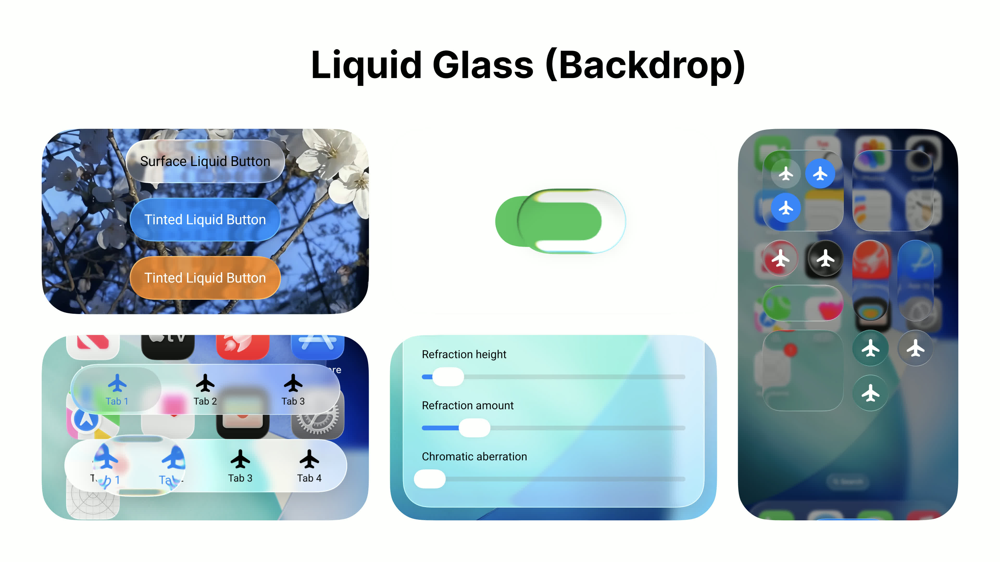
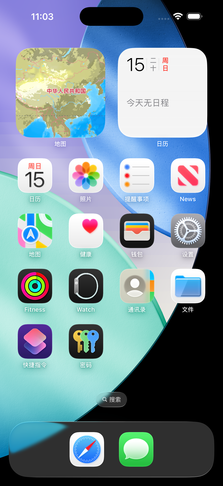
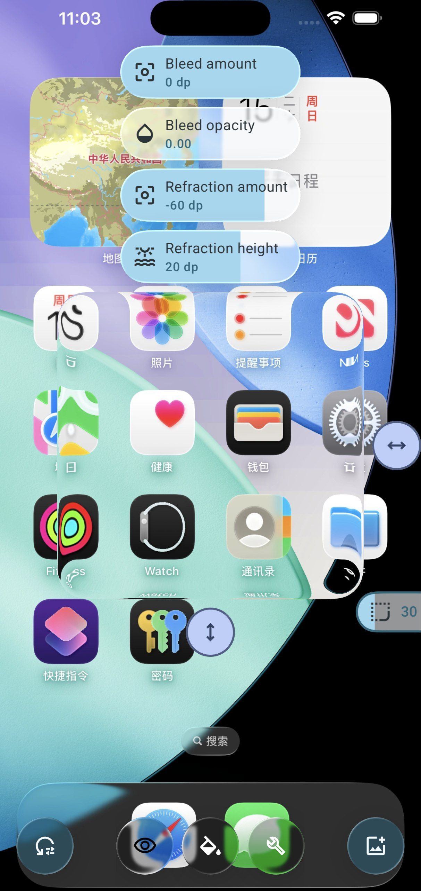
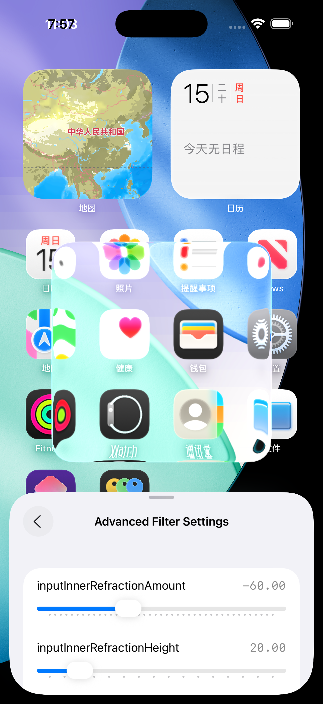
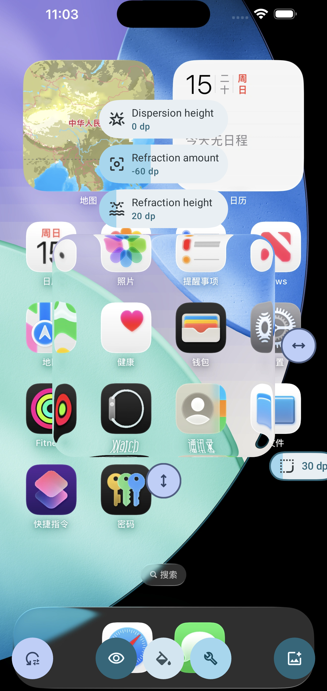

<div data-post-lang="zh">

## 先把话说清楚

2026 年 8 月前后，酷安 Android 客户端 **v16.6.1** 的更新说明里出现了这样几行（多家软件站镜像收录的文案一致）：

> 全新液态玻璃设计风格（需要安卓13及以上系统），向@Kyant0的AndroidLiquidGlass开源致谢  
> 支持材质选择，液态玻璃、背景模糊、半透明

可核对来源示例：[当快软件园酷安 v16.6.1 页](https://www.downkuai.com/android/121366.html)、[vkxiazai 镜像](https://www.vkxiazai.com/app/8682.html)。包名仍是 `com.coolapk.market`，厂商为深圳酷安网络科技有限公司。

这篇文章**不臆造酷安闭源内部类名**，只做三件事：

1. 把更新日志里能核对的事实钉死  
2. 顺着「致谢 AndroidLiquidGlass」去读 Kyant0 开源库与官方文档，还原一套**可公开验证**的实现路径  
3. 补上 Android 平台侧（`RenderEffect` / 窗口模糊 / RuntimeShader）与业界对「液态玻璃」光学近似（SDF + 折射）的公开资料，方便你对照阅读  

如果你在真机上看过酷安底部导航的通透感，下面这套技术栈基本就是公开叙事对齐后的答案。



*来源：[Kyant0/AndroidLiquidGlass](https://github.com/Kyant0/AndroidLiquidGlass) `artworks/banner.jpg`（Apache-2.0）*

## 酷安公开说了什么、没说什么

### 说了什么

| 公开点 | 含义 |
| --- | --- |
| 液态玻璃设计风格 | 产品层命名，指向动态玻璃质感 UI |
| 需要 Android 13+ | 与完整折射（lens / RuntimeShader）能力对齐 |
| 致谢 `@Kyant0` 的 `AndroidLiquidGlass` | 明确依赖/参考该开源方案 |
| 三种材质：液态玻璃 / 背景模糊 / 半透明 | 用户可切换的降级阶梯 |

### 没说什么（因此本文也不假装知道）

- 具体哪个界面 100% 用了哪段 Compose 代码  
- 是否 fork、是否二次封装、参数如何调教  
- iOS 酷安与 Android 是否共用同一套实现  

MagicOS 等系统社区文章里有人夸酷安「适配液态玻璃最到位」，那是**观感评价**，不是工程白皮书；文中只作氛围参考，不作技术论据。

## 致谢对象：AndroidLiquidGlass → Backdrop

GitHub 仓库：[Kyant0/AndroidLiquidGlass](https://github.com/Kyant0/AndroidLiquidGlass)

- 定位：Compose Multiplatform 的 **Liquid Glass / Backdrop** 库  
- 文档：[kyant.gitbook.io/backdrop](https://kyant.gitbook.io/backdrop)  
- 坐标：`implementation("io.github.kyant0:backdrop:<version>")`（见文档 Get started）  
- 许可证：Apache-2.0  
- 设计取舍：库**不提供**开箱即用的整套业务组件；示例包括 `LiquidButton`、`LiquidToggle`、`LiquidSlider`、`LiquidBottomTabs`（README 列出）

对酷安这种「底部导航 + 信息流」产品，README 里的 **LiquidBottomTabs** 示例与文档教程 **Glass Bottom Bar** 高度同构——正是社区里最先被注意到的视觉落点。


*来源：同仓库 `artworks/catalog_app.jpg`*



*来源：同仓库 `artworks/homescreen.png`*

## 核心模型：先捕背景，再画前景玻璃

文档开篇就写明：Backdrop 库能把背景的一份拷贝画到前景，并叠各种效果，从而做出液态玻璃。

公开 API 可以概括成两层：

### 1. Backdrop：玻璃后面是什么

文档 [Backdrops](https://kyant.gitbook.io/backdrop/api/backdrops.md) 区分多种来源：

| API | 作用 |
| --- | --- |
| `rememberLayerBackdrop` + `Modifier.layerBackdrop` | 捕获某段 Composable 的绘制结果（坐标相关） |
| `rememberCombinedBackdrop` | 合并多个 backdrop（滑块、Tab 很常见） |
| `rememberCanvasBackdrop` | 往空 backdrop 自定义绘制（坐标无关） |
| `emptyBackdrop` | 什么都不画 |

教程 [Glass Bottom Bar](https://kyant.gitbook.io/backdrop/tutorials/glass-bottom-bar.md) 的标准骨架是：

```kotlin
Box(Modifier.fillMaxSize()) {
    val backgroundColor = Color.White
    val backdrop = rememberLayerBackdrop {
        drawRect(backgroundColor)
        drawContent()
    }

    MainNavHost(
        modifier = Modifier.layerBackdrop(backdrop)
    )

    Box(
        Modifier
            .drawBackdrop(
                backdrop = backdrop,
                shape = { CircleShape },
                effects = {
                    vibrancy()
                    blur(4f.dp.toPx())
                    lens(16f.dp.toPx(), 32f.dp.toPx())
                },
                onDrawSurface = { drawRect(Color.White.copy(alpha = 0.5f)) }
            )
            .height(64f.dp)
            .fillMaxWidth()
            .align(Alignment.BottomCenter)
    )
}
```

要点：

- 只把 `MainNavHost` 记进 backdrop、却忘了页面底色时，底栏会出现「透出空洞」——教程第一步专门踩了这个坑，随后用 `drawRect(backgroundColor)` 补背景。  
- `onDrawSurface` 叠半透明白，是为了**可读性**；文档明确说要在好看和可读之间取舍。

### 2. Effects：光怎么穿过玻璃

文档 [Backdrop effects](https://kyant.gitbook.io/backdrop/api/backdrop-effects.md) 写得很硬：

> Backdrop effects are `RenderEffect`s radically. They only take effect with Android 12 and above. Some effects involving with `RuntimeShader` need Android 13 and above.

推荐叠加顺序：

> **color filter ⇒ blur ⇒ lens**

常用效果（文档原文能力）：

| 效果 | 作用 | 版本门槛（文档） |
| --- | --- | --- |
| `vibrancy()` | 饱和度 ×1.5（等价 `colorControls(saturation=1.5f)`） | 随 RenderEffect |
| `blur(radius)` | 高斯模糊 | Android 12+ |
| `lens(refractionHeight, refractionAmount, …)` | 边缘折射；可选 `depthEffect`、`chromaticAberration` | **Android 13+** |
| `opacity` / `colorControls` | 透明度与校色 | 随 RenderEffect |
| `runtimeShaderEffect` | 自定义 RuntimeShader | Android 13+ |

`lens` 还有形状约束：文档警告 **shape 必须是 `CornerBasedShape`**，且 `refractionHeight` 建议不超过圆角半径，否则边角可能出现不连续。



*来源：同仓库 `artworks/playground_app.jpg`*

## 三种材质：怎么和公开能力对齐

酷安提供用户可选的三种材质。结合更新日志门槛与 Backdrop 文档，**合理对齐**如下（标注为推断，不是反编译结论）：

| 酷安选项 | 更可能对应的效果组合 | 依据 |
| --- | --- | --- |
| **液态玻璃** | `vibrancy` + `blur` + **`lens`**（完整折射） | 更新日志要求 Android 13+；文档写明 lens 需 13+ |
| **背景模糊** | 以 `blur` 为主，弱化/关闭 lens | Android 12 起就有 `RenderEffect` 模糊；观感更接近传统磨砂 |
| **半透明** | 半透明表面色（类似 `onDrawSurface` / 低成本 scrim），弱模糊或无模糊 | 最低成本、兼容面最宽的「玻璃感」替代 |

这正好构成产品常见的**效果阶梯**：高端机吃满折射，中端吃模糊，再不行至少半透明不穿帮。

Android 平台原生也提供「窗口背景模糊 / 后方模糊」能力（AOSP：[窗口模糊处理](https://source.android.com/docs/core/display/window-blurs?hl=zh-cn)），但它是**窗口级**能力，和 Compose 里对某一层 UI 做 lens 折射不是同一件事。酷安致谢的是 Compose 侧 Backdrop 库，而不是单纯打开系统对话框模糊。

## 为什么点名 Android 13

两层原因叠在一起：

1. **文档硬门槛**：`lens` 与部分 RuntimeShader 效果需要 Android 13+。  
2. **平台能力**：`RenderEffect` 自 API 31（Android 12）起可用；更复杂的 `RuntimeShader` / AGSL 链路在更高版本上才完整。官方 API 见 [RenderEffect](https://developer.android.com/reference/android/graphics/RenderEffect)。

因此更新日志写「液态玻璃需要安卓 13 及以上」，与开源库公开约束一致——这不是营销口号，是能力边界。

## 「液态」到底多了一层什么：SDF 与折射（通用原理）

苹果 iOS 的 Liquid Glass 带火了「边缘折射 + 渗色 + 模糊」这一套视觉语言。公开技术复盘（**不是酷安源码**）里，常见叙事是：

1. 用形状得到 **SDF（有符号距离场）**  
2. 用 SDF 梯度当**法线方向**  
3. 沿法线做采样偏移 → 看起来像光被玻璃边缘掰弯  
4. 再叠高斯模糊、高光、色散（chromatic aberration）

可参考：

- LengYue：[在 Android 中实现 iOS 液态玻璃效果](https://apkdv.com/posts/implementing_ios_liquid_glass_effect_in_android/)  
- LengYue：[折射与渗透效果分析](https://apkdv.com/posts/analysis_of_ios_liquid_glass_technology/)  
- Lrdcq：[Android GlassView 流程（离屏形状 → SDF → backdrop → RuntimeShader）](https://lrdcq.com/me/read.php/166.htm)

Kyant0 仓库甚至提供了 iOS / Android 内折射对比图，方便肉眼对齐：



*来源：Kyant0/AndroidLiquidGlass `artworks/ios_inner_refraction.png`*



*来源：同仓库 `artworks/android_inner_refraction.png`*

读酷安时建议记住边界：

- 酷安致谢的是 **Backdrop / AndroidLiquidGlass** 这条 Compose 产品化路径；  
- SDF 长文多是**独立复刻实验**，性能数字（例如 Lrdcq 文中提到的 SDF 每帧压力）不能直接当成酷安线上指标。

## 和「玻璃拟态」旧方案差在哪

| | 旧玻璃拟态（常见） | 液态玻璃（Backdrop 文档路径） |
| --- | --- | --- |
| 背景 | 静态图 / 一次性截图模糊 | 持续捕获的 layer backdrop |
| 边缘 | 渐变描边、高光贴图 | `lens` 基于形状的折射 |
| 动态 | 列表滑过时容易「假」 | 背景内容变化会进入折射采样 |
| 实现面 | 任意 View / 纯 Drawable | Compose + RenderEffect 链路 |

这也解释了为什么信息流 App 愿意上它：底部 Tab 下面永远在滚内容，只有「真采样背景」才像玻璃，而不是一块磨砂贴纸。

## 开发者若要复刻「酷安同款路径」

按公开文档，最小清单是：

1. Compose 工程引入 `io.github.kyant0:backdrop`  
2. 用 `rememberLayerBackdrop` 包住主内容（别漏底色）  
3. 底栏 / 悬浮控件用 `drawBackdrop`  
4. 效果顺序：`vibrancy()` → `blur(...)` → `lens(...)`  
5. 用 `onDrawSurface` 保字色对比度  
6. 产品层做三档材质，对应开关 lens / blur / 仅半透明  
7. Android 13 以下明确降级文案（酷安直接写进了更新日志）

进阶：

- Tab / Slider 用 `rememberCombinedBackdrop`（官方 Glass Slider 教程）  
- 自定义光学用 `runtimeShaderEffect`（仍受 API 约束）

## 性能与体验：公开资料提醒

从平台与第三方实验能确认的风险：

- **模糊半径过大**会伤帧率；AOSP 窗口模糊文档甚至建议避免过大半径。  
- **折射 + 每帧重算形状**是重活；独立 GlassView 实验文指出 SDF 更新是瓶颈。  
- Backdrop 文档强调效果顺序与形状约束——参数乱叠会先「难看」再「卡」。  
- 可读性：通透过度会让图标和文字「溶」进信息流，所以教程才强调 surface 叠加。

酷安把材质做成设置项，本身就是产品侧的性能/偏好阀门。

## 小结

1. **事实**：酷安 v16.6.1 上线液态玻璃风格，Android 13+，致谢 Kyant0 AndroidLiquidGlass，并提供三种材质。  
2. **路径**：公开可验证的技术落点是 Compose **Backdrop** 库——`layerBackdrop` 捕背景，`drawBackdrop` 叠 `vibrancy` / `blur` / `lens`。  
3. **门槛**：完整「液态」依赖 Android 13+ 的 lens / RuntimeShader；模糊与半透明是合理降级。  
4. **光学**：SDF + 法线折射是业界对 Liquid Glass 的公开解释框架；请与酷安闭源实现解耦阅读。  
5. **态度**：第三方 App 能把开源致谢写进更新日志，本身就值得记一笔——可复现、可学习、可对照。

## 主要参考（均可点击核对）

- 酷安 v16.6.1 更新说明镜像：[downkuai](https://www.downkuai.com/android/121366.html)  
- [Kyant0/AndroidLiquidGlass](https://github.com/Kyant0/AndroidLiquidGlass)  
- [Backdrop 文档](https://kyant.gitbook.io/backdrop) · [Glass Bottom Bar](https://kyant.gitbook.io/backdrop/tutorials/glass-bottom-bar.md) · [Effects](https://kyant.gitbook.io/backdrop/api/backdrop-effects.md)  
- Android [RenderEffect](https://developer.android.com/reference/android/graphics/RenderEffect) · AOSP [窗口模糊](https://source.android.com/docs/core/display/window-blurs?hl=zh-cn)  
- LengYue / Lrdcq 的液态玻璃原理文（上文已链）

</div>

<div data-post-lang="en" hidden>

## What we can say without guessing

Around August 2026, Coolapk’s Android client **v16.6.1** shipped release notes that (across multiple download mirrors) read:

> New liquid-glass design language (requires Android 13+), with thanks to @Kyant0’s AndroidLiquidGlass  
> Material picker: liquid glass / backdrop blur / translucent

Example mirrors: [downkuai](https://www.downkuai.com/android/121366.html), [vkxiazai](https://www.vkxiazai.com/app/8682.html). Package id remains `com.coolapk.market`.

This post does **not** invent Coolapk’s private class names. It only:

1. Pins the changelog facts  
2. Follows the credited **AndroidLiquidGlass / Backdrop** docs for a publicly verifiable implementation path  
3. Adds platform references (`RenderEffect`, window blurs) and independent SDF/refraction write-ups so you can cross-check the optics vocabulary  


*Source: [Kyant0/AndroidLiquidGlass](https://github.com/Kyant0/AndroidLiquidGlass) `artworks/banner.jpg` (Apache-2.0)*

## What Coolapk said vs. what it didn’t

**Said:** liquid-glass style; Android 13+; credit to Kyant0’s library; three user-facing materials.

**Didn’t say:** exact screens, whether they forked or wrapped the library, tuning parameters, or iOS parity. Fan posts about MagicOS “best adaptation” are taste, not engineering evidence.

## The credited library: AndroidLiquidGlass → Backdrop

- Repo: [Kyant0/AndroidLiquidGlass](https://github.com/Kyant0/AndroidLiquidGlass)  
- Docs: [kyant.gitbook.io/backdrop](https://kyant.gitbook.io/backdrop)  
- Dependency: `io.github.kyant0:backdrop:<version>`  
- License: Apache-2.0  
- Philosophy: low-level primitives; samples include `LiquidBottomTabs`—the shape most people notice first in a feed app


*Source: repo `artworks/catalog_app.jpg`*


*Source: repo `artworks/homescreen.png`*

## Core model: capture a backdrop, then draw glass

### Backdrops ([docs](https://kyant.gitbook.io/backdrop/api/backdrops.md))

`rememberLayerBackdrop` + `Modifier.layerBackdrop` capture composable output; `rememberCombinedBackdrop` merges sources (tabs/sliders); canvas/empty variants cover custom or blank cases.

### Effects ([docs](https://kyant.gitbook.io/backdrop/api/backdrop-effects.md))

> Effects are `RenderEffect`s. Android 12+ required; `RuntimeShader`-based pieces need **Android 13+**.

Recommended order: **color filter ⇒ blur ⇒ lens**.

| Effect | Role | Gate |
| --- | --- | --- |
| `vibrancy()` | ×1.5 saturation | RenderEffect |
| `blur` | Frost | Android 12+ |
| `lens` | Edge refraction; optional depth / chromatic aberration | **Android 13+** |
| surface draw | Readability scrim | App-controlled |

Official [Glass Bottom Bar](https://kyant.gitbook.io/backdrop/tutorials/glass-bottom-bar.md) tutorial shows the full recipe: layer the main nav host into a backdrop, then `drawBackdrop` with `vibrancy` + `blur` + `lens`, plus a translucent white surface so icons stay readable.


*Source: repo `artworks/playground_app.jpg`*

## Mapping Coolapk’s three materials (informed inference)

| Coolapk option | Likely effect mix | Why |
| --- | --- | --- |
| **Liquid glass** | vibrancy + blur + **lens** | Changelog requires Android 13+; lens docs match |
| **Backdrop blur** | blur-forward, little/no lens | Classic frosted look on Android 12+ RenderEffect |
| **Translucent** | tinted scrim / weak blur | Cheapest fallback |

AOSP also documents [window blurs](https://source.android.com/docs/core/display/window-blurs), but that is window-level chrome—not the same as Compose lens refraction on a bottom bar. Coolapk’s credit points at Backdrop, not merely toggling system dialog blur.

## Why Android 13 is called out

Docs hard-gate `lens` / some runtime shaders on Android 13+. `RenderEffect` itself arrives at API 31 ([reference](https://developer.android.com/reference/android/graphics/RenderEffect)). The changelog line matches the library’s public constraints.

## Optics vocabulary (general, not Coolapk source)

Independent write-ups approximate Liquid Glass as SDF → gradient-as-normal → sample offset (refraction) → blur / bleed / chromatic aberration:

- [LengYue — implementing on Android](https://apkdv.com/posts/implementing_ios_liquid_glass_effect_in_android/)  
- [LengYue — refraction & penetration](https://apkdv.com/posts/analysis_of_ios_liquid_glass_technology/)  
- [Lrdcq — GlassView pipeline](https://lrdcq.com/me/read.php/166.htm)

Kyant0 even ships iOS/Android inner-refraction comparison art:


*Sources: repo `artworks/ios_inner_refraction.png` / `android_inner_refraction.png`*

Treat those essays as **optics literacy**, not a claim about Coolapk’s private codepaths or FPS.

## Old glassmorphism vs. this path

Static frosted stickers fake depth; Backdrop continuously samples live content so a scrolling feed still bends through the bar. That is why feed apps care.

## If you want the same public path

1. Add `io.github.kyant0:backdrop`  
2. `rememberLayerBackdrop` around main content (include background color)  
3. `drawBackdrop` on chrome  
4. Order: vibrancy → blur → lens  
5. Keep a surface scrim for contrast  
6. Ship three material tiers for API / battery / taste  
7. Document the Android 13+ gate the way Coolapk did  

## Takeaways

Coolapk’s v16.6.1 note is unusually actionable: it names the open-source project. Follow that thread and you land on Compose **Backdrop**—capture with `layerBackdrop`, render with `drawBackdrop`, escalate from translucent → blur → full lens on Android 13+. Everything else in this article is labeled either platform documentation or independent research so you can keep facts and inferences apart.

## References

- Coolapk v16.6.1 mirrors linked above  
- [Kyant0/AndroidLiquidGlass](https://github.com/Kyant0/AndroidLiquidGlass) & [Backdrop docs](https://kyant.gitbook.io/backdrop)  
- Android RenderEffect & AOSP window-blur docs  
- LengYue / Lrdcq articles linked above  

</div>
