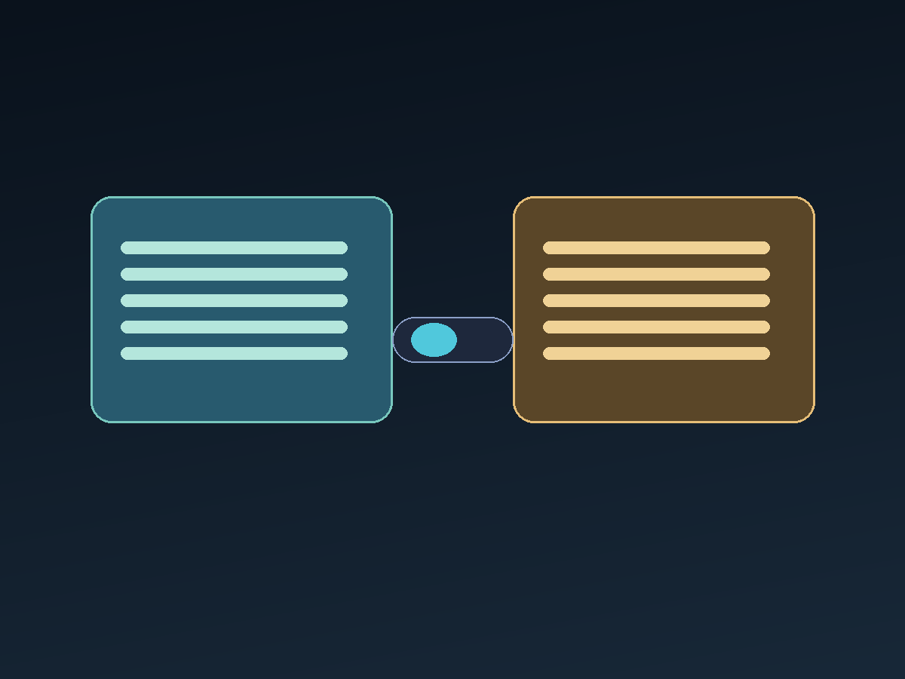

## 先说清楚：两个名字，两层能力

**Grok** 多半指对话模型本身——你在聊天框里问它，它用文字回答。气质偏直接、爱开玩笑，也敢接一些别的助手会绕开的问题。

**Grok Bot** 则更像「住在你电脑里的助手」：不只回话，还能看屏幕、跑命令、改文件、连 GitHub / Vercel，把一件事从说到做串起来。

一句话：**Grok 是脑力，Grok Bot 是手脚。**

## Grok：适合聊清楚「是什么 / 为什么」

我会把这些事丢给 Grok（或同类对话模型）：

- 快速扫一遍概念，理清利弊
- 改一段文案、起个标题
- 头脑风暴：方案 A / B / C 怎么取舍

它强在**语言与推理**，弱在**真实世界副作用**——它不能替你点确认、也不能保证仓库里的代码已经合并。

## Grok Bot：适合把「做到」交给它

当目标变成「把博客部署上线」「把首页占位删掉」「项目页跟 GitHub 实时同步」时，纯聊天就不够了。Grok Bot 这类助手可以：

1. 在仓库里改代码并提交  
2. 推送到 GitHub、触发 Vercel 部署  
3. 用浏览器或 API 验收结果  
4. 记住你的偏好（例如默认中文、优先 GitHub）

代价也很真实：权限更大，就要更谨慎——危险操作应确认，密钥不该进聊天记录。

## 中英切换：页面和文章都该跟

博客顶部的语言切换，如果只改导航文案、正文仍锁死中文，体验是半成品。

更完整的做法是：

- **壳子**（导航、按钮）走词条表  
- **文章**准备中英两份正文，同一 URL，按当前语言显示

这样读者点一次「EN / 中文」，标题、摘要和正文会一起变——这篇文章本身就是这样接的。

## 我怎么分工

| 场景 | 更常找谁 |
| --- | --- |
| 想清楚命题、写段落 | Grok / 对话模型 |
| 改站、开 PR、部署、查线上 | Grok Bot |
| 需要决策或拍板 | 人（我）先定，再让 Bot 执行 |

模型负责速度与广度，Bot 负责闭环，人负责方向。

## 小结

Grok 让你把话说清；Grok Bot 让你把事做完。两者叠在一起，才是「AI 助手」从聊天框走到工作流的样子。

若你也在搭个人站，不妨先写一篇双语文、再让助手把部署链路跑通——比只收藏一百个 Prompt 有用得多。

## Two names, two layers

**Grok** usually means the chat model: you ask, it answers in text—direct, sometimes irreverent, strong at explanation and ideation.

**Grok Bot** is closer to a desktop teammate: it can look at a screen, run commands, edit files, talk to GitHub or Vercel, and carry a task from “idea” to “shipped.”

In short: **Grok is the brain; Grok Bot is the hands.**

## Grok: great for “what” and “why”

I reach for a chat model when I need to:

- Map a concept and tradeoffs quickly  
- Tighten copy or titles  
- Brainstorm options A / B / C before deciding  

It shines at **language and reasoning**. It does not create real-world side effects by itself—it will not click “confirm” for you or guarantee a PR is merged.

## Grok Bot: great for “make it real”

When the goal is “deploy the blog,” “delete homepage placeholders,” or “sync the projects page with GitHub,” chat alone is not enough. A bot can:

1. Edit the repo and commit  
2. Push to GitHub and trigger a Vercel deploy  
3. Verify with the browser or APIs  
4. Remember preferences (Chinese-first, GitHub-first, and so on)

With more power comes more care: confirm destructive steps, and keep secrets out of the transcript.

## Language toggle should cover the article too

If the header switch only flips nav labels while the post stays Chinese-only, the experience feels unfinished.

A fuller setup:

- **Chrome** (nav, buttons) uses a message table  
- **Posts** ship zh + en bodies on the same URL, shown by the active locale  

One tap on **EN / 中文** should update title, blurb, and body together—this post is wired that way.

## How I split the work

| Situation | Who I lean on |
| --- | --- |
| Clarify the brief, draft prose | Grok / chat model |
| Change the site, open PRs, deploy, check prod | Grok Bot |
| Decide direction | Me first, then the bot executes |

Models give speed and breadth; bots close the loop; humans set direction.

## Takeaway

Grok helps you say it clearly. Grok Bot helps you get it done. Together they move “AI assistant” from a chat box into a real workflow.

If you are building a personal site, write one bilingual post and let an assistant run the deploy pipeline—more useful than hoarding another hundred prompts.

