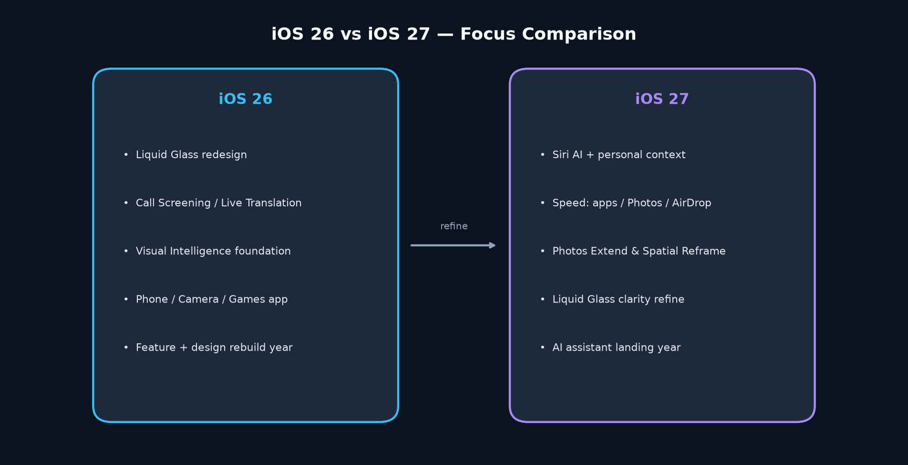
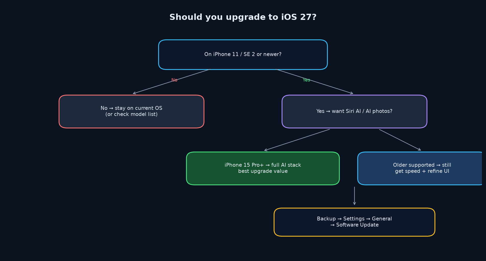
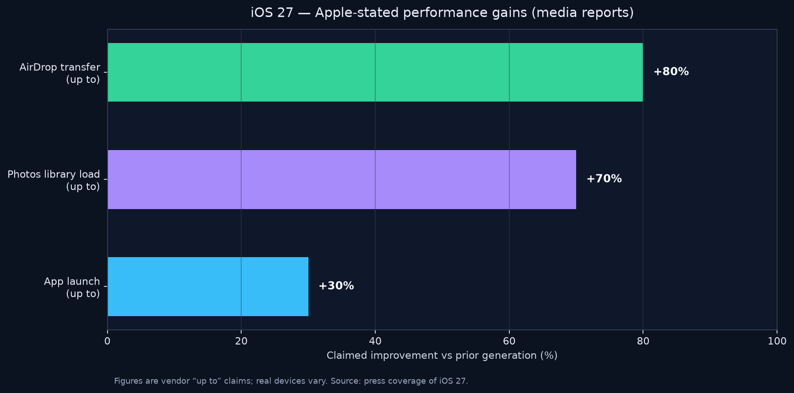
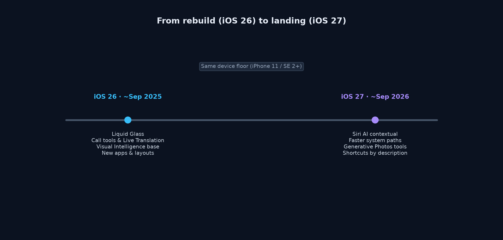
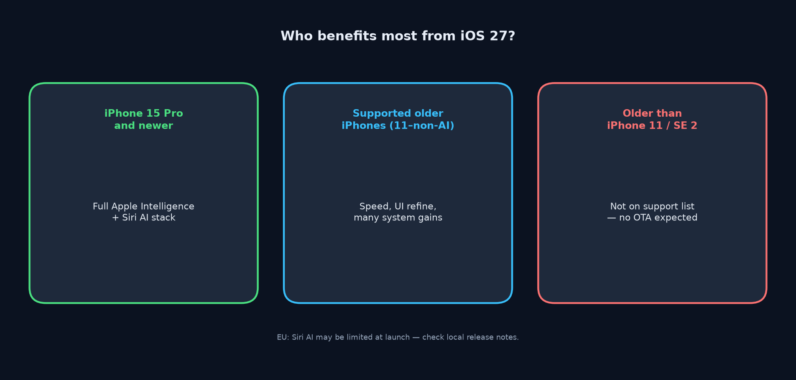

## 先说结论：你该不该升到 iOS 27？

如果你还在 iOS 26，心里大概有两件事打架：一边是「听说更聪明了、更快了」，一边是「才习惯 Liquid Glass，别再折腾」。这篇不写说明书腔，只帮你做判断——**iOS 26 是外观与底座重构的大年；iOS 27 是把 AI 助手真正落地，再叠一层速度与安全 refine**。

下文事实来自 **2026 年 9 月前后的公开报道与媒体整理**，苹果正式文案与各区可用功能可能仍有差异，**请以你设备上的系统提示与设置为准**。

*三大支柱：26 重设计与底座，27 重 Siri AI 与日常速度。*

---

## 一张表看懂：iOS 26 vs iOS 27

| 维度 | iOS 26（约 2025-09） | iOS 27（约 2026-09-14 公开发布） |
| --- | --- | --- |
| 主叙事 | 功能 + 设计大年：整机「长什么样」被重写 | AI 助手落地 + 性能/安全 refine |
| 视觉 | Liquid Glass 全面登场：通透、折射、控件层重构 | 同一套玻璃语言的 refine：折射率、对比度、图标锐度 |
| 助手 | Visual Intelligence 等能力铺垫；Siri 仍偏「旧范式」 | **Siri AI**：个人上下文、跨 App、独立 Siri App / 对话历史 |
| 通信与电话 | Call Screening、Live Translation、Phone 改版 | 延续底座；体验重心转向助手与交接（如 Handoff 双机同号等，据公开报道） |
| 影像 | Camera 改版；Visual Intelligence 切入视觉理解 | Photos Extend & Spatial Reframe；Image Playground 更趋写实；相机内可唤起 Siri / Visual Intelligence |
| 游戏与系统应用 | Games app 等系统级入口 | 继续打磨日常流畅度，而不是再开一条「新皮肤」主线 |
| 自动化 | Shortcuts 仍偏结构化搭建 | **自然语言建 Shortcuts**（据公开报道） |
| 性能体感 | 为新材质与新框架买单，部分机型曾有「炫但重」的讨论 | 启动最高约 **30%**、相册加载约 **70%**、AirDrop 约 **80%**（苹果披露的峰值表述，据公开报道） |
| 钱包等 | — | 钱包分账等（美区等，据公开报道；以当地可用为准） |
| 机型名单 | iPhone 11 及更新、SE（第二代）及更新 | **同兼容列表** |
| AI 门槛 | Apple Intelligence 相关能力本就分层 | Siri AI / Apple Intelligence 多需 **iPhone 15 Pro 及以上**；欧区等地上线可能受限 |

一句话：**26 改变你「看见」手机的方式；27 改变你「使唤」手机的方式——前提是你的机型与地区够得着 Siri AI。**

---

## 该升还是再等等？

*该不该升：看机型、地区、以及对「助手」的真实需求。*

### 更值得尽快升的人

- **iPhone 15 Pro 及以上**，且语言 / 地区能用上 Siri AI：这是 27 的主菜，个人上下文、跨 App、对话历史会明显改变日常提问方式。
- **觉得 26 有点「沉」或滚动不够跟手**：公开报道里的启动、相册、AirDrop 加速，对老机与中端机往往比「又一个新特效」更有体感。
- **已经习惯 Liquid Glass**：27 是 refine，不是再来一次整容；心理成本通常低于从 25 跳到 26。
- **重度用照片 / 相机**：Extend、Spatial Reframe、相机内视觉智能与更写实的 Image Playground，值得试一轮。

### 可以再观望的人

- **欧区等 Siri AI 可能受限的地区**：若你升 27 主要是为了新 Siri，先确认当地可用性，再决定要不要为性能与 refine 单独升级。
- **iPhone 11～14 / 非 Pro 的 15**：你拿得到系统更新与多项加速，但 **吃不到完整 Siri AI 主线**；若当前稳定、插件与银行 App 都正常，等一个点版本也无妨。
- **刚完成大迁移、工作机零容忍翻车**：先看关键 App 兼容说明，备份后再动；大版本永远值得多留一天观察窗口。

### 和「升不升级」无关、但要想清楚的事

升级解决的是系统能力；**解决不了「你并不需要一个更会聊天的助手」**。若你几乎不用 Siri，27 对你仍可能有价值——主要来自速度、照片与玻璃可读性——只是别被标题党绑票。

也可以换个问法：你最近三个月有没有反复骂过这几件事——相册转圈、隔空投送像在等公交、点开常用 App 要愣一下、玻璃面板上的字在亮壁纸上发飘？如果有，27 的「非 AI」部分就和你有关。如果没有，而你又够不着 Siri AI，那继续待在稳定的 26，并不是「落伍」，只是把风险预算留给真正需要大版本的时刻。

---

## 设计：Liquid Glass 从「登场」到「好读一点」

iOS 26 把 Liquid Glass 推成跨控件、跨导航的材料语言：通透、折射、动态感强，也带来过可读性与眩晕讨论。iOS 27 据公开报道，把力气花在 **折射率、对比度与图标锐度** 的 refine 上——同一套美学，少一点「溶掉」，多一点「还认得清字」。

对还在 26 的人，这意味着：你不必为了「换皮肤」而升 27；若你嫌玻璃有时抢戏，27 更像是在修这门课的作业。对已开「降低透明度」的用户，refine 仍建议亲自看一眼锁屏、控制中心与底栏，以自己的视力与壁纸为准。

设计评审里有个朴素标准也适用个人升级：把壁纸换成最花、最亮的一张，再扫一眼通知、控制中心和底栏标签——若你仍觉得「好看但费劲」，那可读性 refine 对你的优先级，可能高于再多一个生成图玩法。反过来，若你几乎只用深色模式、字号偏大，玻璃争议对你本来就弱，就别被网上截图带节奏。

---

## Siri AI：27 真正想卖的东西

据公开报道与苹果相关介绍的媒体整理，Siri AI 大致长这样：

- **个人上下文**：能结合你设备上的信息脉络回答「更贴你」的问题（具体可访问范围以系统权限与设置为准）。
- **跨 App 行动**：不再只是打开某个 App，而是更接近「帮我把这件事做完」。
- **独立 Siri App / 对话历史**：助手有了可回看的会话空间，而不是说完即散。
- **相机与视觉**：在 Camera 里直接接上 Siri / Visual Intelligence，把「看见」和「提问」焊在一起。
- **自然语言建 Shortcuts**：用说话或打字描述流程，而不是先学会积木式编排。

同时要说清楚门槛（据公开报道）：

- 硬件上，Apple Intelligence / Siri AI **多需 iPhone 15 Pro 及以上**。
- 发布节奏上，语言与地区会分批；**欧区等地上线可能受限**。
- 首次启用时，系统可能需要一段时间建立索引——别指望插上电源五分钟就「全知」。

若你把 26 理解成「给 AI 铺好舞台」，那 27 才是演员上场。舞台（Liquid Glass、Phone/Camera 改版、Visual Intelligence 等）在 26 已经搭过一轮；27 问的是：你愿不愿意让助手更深地碰你的个人数据与跨 App 权限。

实务上建议把期望拆成两层：第一层是「问答更自然、能引用你手机里的线索」；第二层是「真的跨 App 把事做完」。后者高度依赖 App 适配与权限，首周体感可能参差。英文等语言若已开放、你的中文或欧区能力仍在等待，也属公开报道里常见的分批节奏——别把朋友圈里别人的演示，直接当成自己菜单里的默认项。

---

## 照片与创作：Extend、Spatial Reframe、更写实的 Playground

影像线在 27 的故事不是「再做一个滤镜」，而是：

- **Photos Extend & Spatial Reframe**（据公开报道）：扩展画面与空间 reframing，适合旅行照、合影裁切、想「多一点周边」的构图。
- **Image Playground 更趋写实**：生成图从「插画感」往「更像照片」靠，创作与恶搞的边界也会更模糊——分享前请看清是否需标注生成内容。
- **相机内 Siri / Visual Intelligence**：拍的时候就能问、就能查，减少「先存进相册再回头搜」的断点。

还在 26 的人：你的 Camera / Photos 大改版底座多半已经经历过；27 更像在已有入口上加「能做完」的一步。

若你是「拍完就丢进相册、偶尔翻翻回忆」的轻度用户，Extend / Reframe 可能只是锦上添花；若你经常裁合影、修旅行构图，或需要边拍边查眼前物件，27 的影像线会比再多一个主题图标更有用。生成图更写实之后，家庭群和客户群里也更容易误认——养成发布前多看一眼的习惯，比纠结模型名字更重要。

---

## 性能：三个数字，怎么读才不翻车

*启动、相册、AirDrop：公开报道中的峰值加速表述。*

据公开报道，苹果披露过大致如下峰值：

- App **启动**最高约 **30%** 更快  
- **相册加载**约 **70%** 更快  
- **AirDrop** 约 **80%** 更快  

读法建议：

1. **「最高约」不是你的机型承诺。** 实验室峰值 ≠ 你通勤路上的微信。  
2. **老机可能更有感。** 媒体整理里提到调度与优化会惠及较旧机型；体感因人而异。  
3. **别只拿跑分说话。** 日常价值往往是：点开相册少转圈、隔空投送少盯进度条、热启动少「点了没反应」。

若你升 27 的唯一理由是跑分截图，可能失望；若你烦的是「小卡顿」，这条线值得认真看。

---

## 安全、隐私与「双机同号」这类生活向能力

大版本里，安全与隐私很少成为海报主视觉，却决定你敢不敢开 Siri AI。公开报道还提到例如：

- **钱包分账**（美区等，以当地可用为准）  
- **Handoff 双机同号** 等连续互通向能力  

原则很简单：**助手越懂你，权限面越大。** 升级后建议专门走一遍：Siri / Apple Intelligence 开关、分析数据、跨 App 控制、锁屏可见范围。不是吓你，是避免「为了好玩默认全开」。

家庭共享与儿童设备更要单独看：公开报道里对年龄与能力可用性常有额外限制，别假设「家长机升了，孩子机就自动同款智能」。工作机则优先确认：公司邮箱、MDM、行业 App 是否声明支持 27；「能升」不等于「现在就该升」。

---

## 时间线：两年在解决两件不同的事

*从 Liquid Glass 大改版，到 Siri AI 与速度 refine。*

- **约 2025-09 · iOS 26**：Liquid Glass；Call Screening；Live Translation；Visual Intelligence；Games app；Phone / Camera 改版——**功能 + 设计**双线大年。  
- **约 2026-09-14 · iOS 27**：同兼容列表上的一次「能力兑现」：Siri AI 主线、性能三项加速、玻璃与图标 refine、照片与 Playground、自然语言 Shortcuts、相机内智能、钱包分账与 Handoff 等（据公开报道 / 媒体整理）。

对比叙事可以压成一句：**26 重写界面语法；27 重写助手语法，并给语法跑得更轻。**

---

## 机型与限制：谁吃肉，谁喝汤

*同名单可升级；Siri AI 仍看 Pro 级门槛与地区。*

- **可装 iOS 27**：与 26 同名单——**iPhone 11 及更新、SE（第二代）及更新**（据公开报道）。  
- **更能吃满 Siri AI / Apple Intelligence**：多需 **iPhone 15 Pro 及以上**。  
- **地区与语言**：欧区等可能受限；语言也可能分批放开——装完系统不等于菜单里一定有完整 Siri AI。  
- **存储与发热**：大版本首周建议留足空间、避开「边下边拍 4K 边隔空投送」的极限操作。  
- **电池焦虑**：新系统前几天后台整理更勤，耗电曲线可能难看一点；观察三天再下「续航崩了」的结论通常更公平。  
- **配件与车机**：CarPlay、手表配对、蓝牙耳机固件偶发需要二次连接——升完先做一次「通勤全链路」自检，比只在家连 Wi‑Fi 点几下可靠。

---

## 升级步骤与回退注意（博客版，不写逐步截图）

1. **备份**：iCloud 或电脑完整备份；重要验证码与验证器另有出路。  
2. **电量与网络**：插电、稳定 Wi‑Fi；公司 VPN 怪异时先切常规网络。  
3. **路径**：设置 → 通用 → 软件更新；或到店 / 电脑更新。  
4. **首日耐心**：Siri AI 索引、相册库优化、后台整理，都可能让前几小时更「忙」。  
5. **回退**：大版本签名窗口关闭后，降级会变难甚至不可行。若你高度依赖某款尚未适配的行业 App，**先查开发者说明，再点升级**；不要默认「一定能刷回 26」。

---

## 结论清单：升完怎么验收

- [ ] 我清楚自己是为了 **Siri AI**，还是为了 **速度 / 照片 / 玻璃可读性**。  
- [ ] 我的机型若低于 15 Pro，我接受「系统有了，主菜可能没有」。  
- [ ] 我已确认地区与语言是否覆盖我需要的助手能力。  
- [ ] 备份完成；关键 App 无已知红灯。  
- [ ] 升级后走完隐私与 Siri 权限，而不是全默认。  
- [ ] 用自己的相册、隔空投送、最常用的三五个 App 做体感验收——而不是只看别人的跑分图。

**最后一句：**  
iOS 26 让你的 iPhone **看起来像下一代**；iOS 27 想让它 **听得懂、做得快一点**。升不升级，取决于你要的是新皮肤的余韵，还是新助手的日常——以及你的机型有没有入场券。

## Should you upgrade to iOS 27?

If you are still on iOS 26, you are probably weighing two feelings: “it sounds smarter and faster” versus “I just got used to Liquid Glass.” This is not a setup manual. It is a decision guide.

**iOS 26 was the big year for redesigning how the phone looks and how its foundations sit. iOS 27 is the year the AI assistant is meant to land for real—plus a layer of speed and safety refinement.**

Facts below are drawn from **public reporting and media roundups around September 2026**. Apple’s final wording and regional availability can still differ—**treat on-device prompts and Settings as the source of truth**.

*Three pillars: 26 leans design and foundations; 27 leans Siri AI and everyday speed.*

---

## One table: iOS 26 vs iOS 27

| Lens | iOS 26 (~Sep 2025) | iOS 27 (~public release Sep 14, 2026) |
| --- | --- | --- |
| Story | Features + design year: what the phone *looks like* is rewritten | AI assistant lands + performance / safety refine |
| Visual | Liquid Glass arrives systemwide | Same language, refined: refraction, contrast, icon sharpness |
| Assistant | Visual Intelligence and related groundwork; classic Siri paradigm | **Siri AI**: personal context, cross-app actions, dedicated Siri app / history |
| Phone / comms | Call Screening, Live Translation, Phone redesign | Continuity focus (e.g. dual-device same-number Handoff, per reports) |
| Camera / Photos | Camera redesign; Visual Intelligence | Photos Extend & Spatial Reframe; more photoreal Image Playground; Siri / Visual Intelligence inside Camera |
| System apps | Games app and other system entries | Everyday fluidity over another full visual reboot |
| Automation | Structured Shortcuts building | **Natural-language Shortcuts** (per public reports) |
| Performance | Paying the cost of new materials/frameworks | App launch up to ~**30%**, Photos load ~**70%**, AirDrop ~**80%** (Apple peak-style claims, per reports) |
| Wallet etc. | — | Split bills in Wallet (e.g. US availability; check locally) |
| Device list | iPhone 11 and later, SE (2nd gen) and later | **Same compatibility list** |
| AI bar | Apple Intelligence already tiered | Siri AI / Apple Intelligence often need **iPhone 15 Pro or newer**; EU and similar regions may be limited |

In one line: **26 changed how you *see* the phone; 27 changes how you *command* it—if your hardware and region qualify for Siri AI.**

---

## Upgrade now, or wait?

*Upgrade decision: hardware, region, and whether you actually want a deeper assistant.*

### Good reasons to move soon

- **iPhone 15 Pro or newer**, with language/region access to Siri AI: personal context, cross-app work, and conversation history are the main course.
- **iOS 26 feels heavy**: reported gains in launch, Photos, and AirDrop often matter more than another visual trick.
- **You already live with Liquid Glass**: 27 is refine, not another full reskin—usually cheaper mentally than 25→26.
- **You live in Camera / Photos**: Extend, Spatial Reframe, in-camera intelligence, and a more photoreal Playground are worth a week of real use.

### Reasons to wait

- **Regions where Siri AI may be limited (e.g. EU reporting)**: if the new Siri is your only motive, confirm local availability first.
- **iPhone 11–14 / non‑Pro 15**: you still get the OS and many speed wins, but **not the full Siri AI headline**. If you are stable, waiting for a point release is rational.
- **Work phones with zero tolerance for breakage**: check critical apps, back up, and leave a one-day observation window.

### The non-upgrade question

Updates ship capabilities. They do **not** invent a need for a chatty assistant. If you almost never use Siri, 27 can still help via speed, Photos, and glass readability—just do not let the headline buy the ticket for you.

Another framing: have you spent three months muttering about Photos spinners, AirDrop waits, sluggish app wakes, or glass type that washes out on bright wallpapers? If yes, 27’s non-AI work may already be enough reason. If no—and you cannot reach Siri AI—staying on a calm 26 is not “falling behind”; it is saving risk budget for a day you actually need a major jump.

---

## Design: Liquid Glass from debut to “a bit more readable”

iOS 26 made Liquid Glass the material for controls and navigation—translucent, refractive, lively—and sparked readability debates. iOS 27, per public reports, spends effort on **refraction, contrast, and icon sharpness**: same aesthetic, less melt, more legible type.

You do not need 27 just to “change skins.” If glass sometimes steals the show on 26, 27 is closer to grading that homework. If you use Reduce Transparency, still check Lock Screen, Control Center, and the tab bar on *your* wallpaper.

A personal review trick: set the busiest, brightest wallpaper you own, then scan notifications, Control Center, and tab labels. If it still feels pretty-but-tiring, readability refine outranks another generative toy. If you live in Dark Mode with larger type, online glass panic may not be your problem—do not let other people’s screenshots set your agenda.

---

## Siri AI: what 27 is actually selling

Per public reports and media write-ups of Apple’s pitch, Siri AI roughly means:

- **Personal context** — answers that use your on-device information trail (exact scope follows permissions).
- **Cross-app actions** — closer to finishing a task than merely launching an app.
- **Dedicated Siri app / history** — conversations you can revisit.
- **Camera + vision** — Siri / Visual Intelligence inside Camera so seeing and asking stay in one flow.
- **Natural-language Shortcuts** — describe a workflow instead of only stacking blocks.

Clear caveats (per reports):

- Hardware: Apple Intelligence / Siri AI **often require iPhone 15 Pro or newer**.
- Rollout: languages and regions ship in waves; **EU and similar markets may be limited**.
- First run: indexing can take a while—do not expect omniscience in five minutes on charger.

If 26 built the stage (Liquid Glass, Phone/Camera redesign, Visual Intelligence), **27 puts the actor on it**. The real question is whether you want the assistant deeper into personal data and cross-app control.

Split expectations: layer one is “more natural answers that use clues on your phone”; layer two is “actually finishing work across apps.” The second depends on app adoption and permissions, so week-one mileage varies. If English is already open while your language or EU availability is still waiting, that matches the staged rollouts in public reporting—do not treat a friend’s demo as your default menu.

---

## Photos and creation: Extend, Spatial Reframe, more photoreal Playground

- **Photos Extend & Spatial Reframe** (per reports): expand and reframe for travel shots and group crops.
- **Image Playground more photoreal**: generation shifts from illustration-like toward photo-like—label generated shares when needed.
- **Siri / Visual Intelligence in Camera**: ask while you shoot; fewer “save first, search later” breaks.

If you already took the Camera/Photos redesign hit on 26, 27 is less “new entrance” and more “finish the job.”

---

## Performance: how to read three numbers without fooling yourself

*Launch, Photos, AirDrop: peak-style speed claims from public reporting.*

Per public reports, Apple has cited peak-style gains around:

- App **launch** up to ~**30%** faster  
- **Photos** loading ~**70%** faster  
- **AirDrop** ~**80%** faster  

How to read them:

1. **“Up to” is not a promise for your unit.** Lab peaks ≠ WeChat on your commute.  
2. **Older phones may feel it more.** Scheduling/optimization stories in coverage often mention older hardware—results vary.  
3. **Judge daily friction.** Fewer Photo spinners, shorter AirDrop stares, fewer “I tapped and nothing happened” moments.

If you upgrade only for a benchmark screenshot, you may shrug. If micro-stutters annoy you, this line is the quiet headline.

---

## Safety, privacy, and life features like dual-device same number

Poster features rarely lead with privacy, but Siri AI’s depth depends on it. Public reporting also mentions items such as:

- **Wallet split bills** (e.g. US; check local availability)  
- **Handoff with the same number on two devices** and related continuity work  

Rule of thumb: **the more the assistant knows you, the wider the permission surface.** After upgrading, walk Siri / Apple Intelligence toggles, analytics, cross-app control, and Lock Screen visibility—on purpose, not on default.

---

## Timeline: two years, two different problems

*From the Liquid Glass reboot to Siri AI and speed refine.*

- **~Sep 2025 · iOS 26**: Liquid Glass; Call Screening; Live Translation; Visual Intelligence; Games app; Phone/Camera redesign—a **features + design** year.  
- **~Sep 14, 2026 · iOS 27**: on the same device list, a **capability delivery** year: Siri AI, three performance claims, glass/icon refine, Photos/Playground, natural-language Shortcuts, in-camera intelligence, Wallet split, Handoff, and more (public reports / media roundups).

Compressed narrative: **26 rewrote the interface grammar; 27 rewrites the assistant grammar and tries to run it lighter.**

---

## Devices and limits: who gets the steak

*Same install list; Siri AI still gated by Pro-class hardware and region.*

- **Can install iOS 27**: same as 26—**iPhone 11 and later, SE (2nd gen) and later** (per reports).  
- **Fuller Siri AI / Apple Intelligence**: often **iPhone 15 Pro or newer**.  
- **Region & language**: EU and similar limitations possible; installing the OS ≠ full Siri AI menus.  
- **Storage & thermals**: leave free space in week one; avoid extreme “download + 4K + AirDrop” stacks on day one.

---

## Upgrade flow and rollback (blog-short, not a click-path)

1. **Back up** — iCloud or computer; keep authenticators reachable.  
2. **Power + network** — plugged in, steady Wi‑Fi; weird corporate VPNs can wait.  
3. **Path** — Settings → General → Software Update (or a Mac/PC).  
4. **Day-one patience** — indexing and library work can make the first hours busier.  
5. **Rollback** — once signing windows close, downgrading gets hard or impossible. If a work app is not ready, **check the developer before you tap Update**; do not assume you can return to 26.

---

## Closing checklist

- [ ] I know whether I am buying **Siri AI** or **speed / Photos / glass readability**.  
- [ ] If I am below 15 Pro, I accept “OS yes, main course maybe no.”  
- [ ] I checked region/language for the assistant features I care about.  
- [ ] Backup done; critical apps show no known red flags.  
- [ ] Privacy and Siri permissions reviewed—not left on defaults.  
- [ ] I will validate with *my* Photos, AirDrop, and top apps—not someone else’s benchmark graphic.

**Last line:**  
iOS 26 made the iPhone **look next-gen**. iOS 27 wants it to **understand you and feel quicker**. Whether you upgrade depends on whether you want the afterglow of a new skin—or a new assistant in daily life—and whether your phone has a ticket in.

