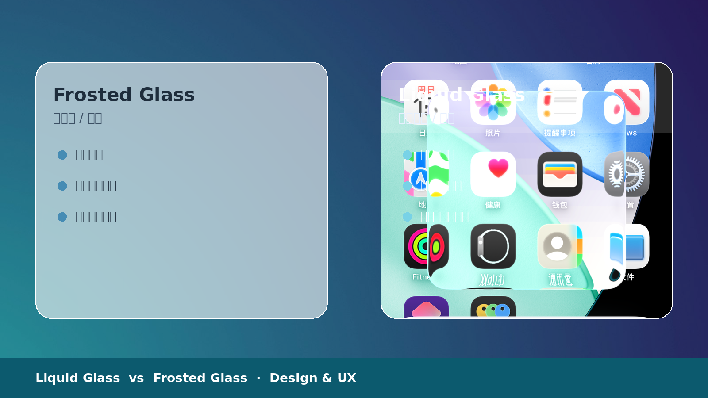
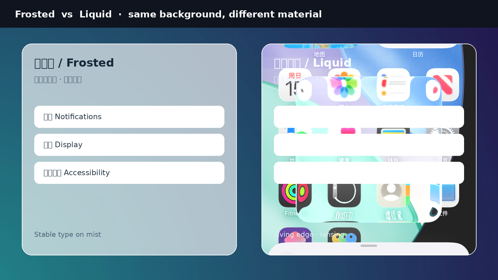
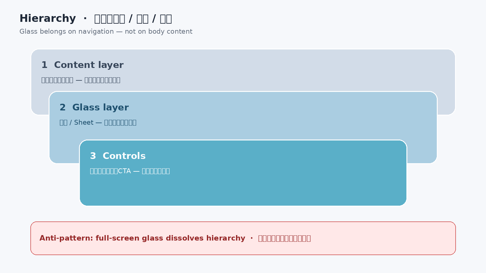
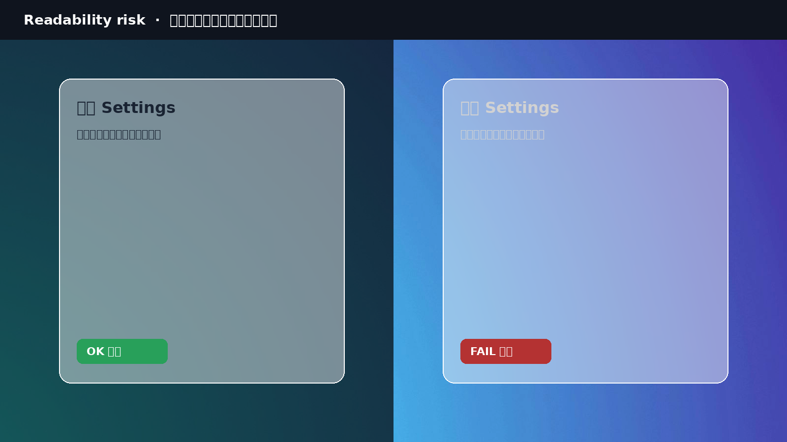
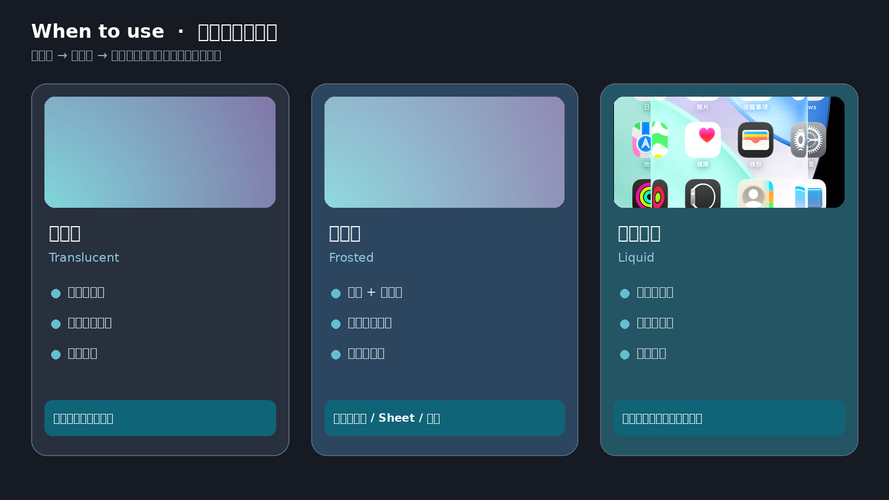

## 开场：用户实际感知到什么

用户很少会说「这是折射」或「这是高斯模糊」。他们更常感受到的是三件事：

1. **通透**：底下的内容还在，界面没有被一块死板色块盖死。
2. **层次**：导航、控件像浮在内容之上，而不是和内容糊成一张平面。
3. **注意力**：眼睛先落在哪里——内容本身，还是浮动的那层「玻璃」。

液态玻璃（Liquid Glass）与毛玻璃 / 磨砂玻璃（Frosted Glass，常被归入 Glassmorphism）都在卖「通透 + 层次」，但卖法不同。前者更强调**会动、会跟着环境变、像真玻璃一样折射与流动**；后者更强调**把背后内容糊掉，换一份稳定、可读的半透明表面**。

*配图说明：左毛玻璃（模糊稳住文字），右液态玻璃（折射与边缘高光）；同一设计语境下的材质对照。*

公开资料上，Apple 在 WWDC 2025 将 Liquid Glass 描述为一种半透明材料：会反射与折射周围环境，并随内容与情境动态变化，用于控件、导航、图标与小组件等，并横跨 iOS / iPadOS / macOS / watchOS / tvOS 等系统层体验（参见 [Apple Newsroom](https://www.apple.com/newsroom/2025/06/apple-introduces-a-delightful-and-elegant-new-software-design/) 与 [Adopting Liquid Glass](https://developer.apple.com/documentation/TechnologyOverviews/adopting-liquid-glass)）。毛玻璃一侧，更常见于 Web / Android 自定义表面：半透明填色 + 背景模糊（如 CSS `backdrop-filter`，或 Android 12+ 窗口背景模糊能力；AOSP 文档也给出磨砂玻璃类半径的经验区间，见 [Window blurs](https://source.android.com/docs/core/display/window-blurs)）。两者都不是「更高级的半透明」，而是两种不同的**信息分层策略**。

---

## 概念对照表：液态玻璃 vs 毛玻璃

| 维度 | 液态玻璃（Liquid Glass） | 毛玻璃 / 磨砂玻璃（Frosted Glass） |
| --- | --- | --- |
| 视觉特征 | 通透、折射、镜面高光、边缘常有「透镜感」；颜色受周围内容影响 | 半透明填色 + 背景模糊；表面偏「雾」；边缘多为柔和裁切 |
| 动态 / 静态 | 强动态：随滚动、触控、设备运动与情境变化（系统材料常实时渲染） | 偏静态：模糊半径与透明度相对稳定；动效多在出现/消失，而非材质本身持续「活着」 |
| 边缘行为 | 边缘可弯曲光、产生畸变或高光游走；形态可 morph（系统组件间常有流体过渡） | 边缘通常干净、可预期；层次靠模糊强度与描边/描影建立 |
| 信息优先级 | 倾向「玻璃是导航/控件层，内容在下」；材料会主动把焦点推回内容 | 倾向「玻璃是可读容器」；先稳住玻璃上的字，再让背景若隐若现 |
| 设计隐喻 | 真玻璃 + 流体（偏物理光学与系统一致性） | 磨砂玻璃板（偏装饰性材质与品牌氛围） |
| 典型出处倾向 | 系统级设计语言（如 Apple Liquid Glass） | 跨平台流行视觉语言（Glassmorphism）与 App 自定义顶栏/弹层 |

*配图说明：同一背景上的两张设置面板——左为毛玻璃静态可读，右为液态玻璃动态光学；菜单结构一致，差异只在材质。*

一句话区分：**毛玻璃是在「糊」背景以换可读；液态玻璃是在「活」的光学层上做导航，并声明内容优先。**

---

## UX 收益：层次感、焦点、一致性与情绪

### 1. 层次感（Depth without heavy chrome）

半透明层让用户理解「这是浮层 / 系统控件，底下还有内容」。比厚重实色 chrome 更轻，比纯透明叠加更不易撞色。

### 2. 焦点引导

Apple 公开表述里，Liquid Glass 会随情境变化，帮助把注意力带回内容（Newsroom / 开发者文档均强调 functional layer for controls and navigation、bring focus to content）。毛玻璃则通过「背景细节下降、前景字上升」制造焦点——适合弹层、工具条上的短标签。

### 3. 系统一致性

当系统已全面采用某种玻璃材质（例如 Apple 平台标准栏、Sheet、控件自动采纳 Liquid Glass），App 跟系统走，用户的心智模型更省力：哪些东西可点、哪些是内容区，靠材质就能猜。

### 4. 情绪价值

通透、轻盈、偏「高级感」与「空间感」。对品牌展示、媒体浏览、创意工具，玻璃材质能传递「现代、精致」。这是真实收益，但**情绪价值不能替代可读性与可操作性**。

*配图说明：示意图：底层内容列表 → 中层毛玻璃/液态玻璃导航 → 顶层可点控件；箭头标出「用户第一眼」应落在内容还是控件，并标注错误用法（整页铺玻璃导致焦点涣散）。*

---

## UX 风险：可读、无障碍、眩晕、卡顿与「溶掉」

### 1. 可读性不稳定

玻璃背后的内容会滚动、变色、高对比花纹。文字对比度变成「移动靶」。WCAG 对普通文本通常要求约 4.5:1 对比（大文本约 3:1）。半透明 + 动态背景时，设计稿上通过的对比，滚动到亮区就可能失败——这是毛玻璃与液态玻璃的共同硬伤，业界讨论也反复指出（例如对 Glassmorphism 与动态对比度的公开批评与实践文）。

### 2. 对比度与无障碍

系统往往提供「降低透明度 / 增强对比 / 减少动态效果」等开关。对 Liquid Glass，社区与无障碍实践中常见路径是开启 Reduce Transparency、Increase Contrast、Reduce Motion 来压低通透与透镜畸变（完整关闭通常不可用）。**产品侧必须按这些偏好提供实色或高对比回退**，而不是假设所有人都看到「设计稿同款玻璃」。

### 3. 运动眩晕与视觉噪音

持续折射、高光游走、背景透过玻璃「跟着滚」，对部分用户会造成不适或分心。数据密集界面（表格、长文、代码）尤其容易变成噪音源。

### 4. 电池、掉帧与「卡顿感」

实时模糊 / 实时折射吃 GPU。中低端机或长列表滚动时，掉帧会被感知为「界面发黏」。Android 侧窗口模糊文档也提醒过大模糊半径会显著影响性能。用户未必说得出「是模糊太重」，但会觉得 App「不跟手」。

### 5. 过度使用导致界面「溶掉」

到处都是玻璃时：边界消失、主次消失、可点区域变难找。炫变成噪音，品牌感变成廉价滤镜。

*配图说明：同一半透明面板分别叠在深色区与浅色区：深色区文字清晰，浅色区对比崩坏；旁注「对比度是移动靶」与「需 scrim / 提高不透明度 / 实色回退」。*

---

## 场景建议

| 场景 | 更稳妥的倾向 | 说明 |
| --- | --- | --- |
| 导航栏 / 底栏 | 系统玻璃（若平台已是 Liquid Glass）或轻度毛玻璃 + 足够不透明度 | 短标签、图标为主；避免把长句塞进玻璃条 |
| 弹层与 Sheet | 毛玻璃或系统材料 + 内容区对比保护 | 模态需要「压住」背景；可读优先于炫 |
| 卡片与控件 | 少用大面积玻璃；小控件可用系统液态玻璃 | 卡片承载正文时，优先实色 / 高不透明表面 |
| 系统级 | 跟随平台材料与自动适配 | 标准组件通常已处理重叠、焦点与可访问性适配 |
| App 级自定义 | 克制；先定义「玻璃只服务哪一层」 | 自定义光学效果更容易踩对比与性能坑 |

**经验法则：**玻璃属于**导航与瞬时控件层**，不属于**正文与数据层**。

---

## 设计决策清单：何时用液态、何时用毛玻璃、何时只用半透明/实色

**优先考虑液态玻璃（或系统等价物）当：**

- 你在 Apple 等已统一该材料的平台上做原生体验，希望与系统栏、控件、Sheet 一致；
- 玻璃主要承载图标、短标签、滑块、分段控件等「控件层」；
- 你能接受并测试动态光学效果，且为 Reduce Transparency / Reduce Motion 等偏好准备了回退。

**优先考虑毛玻璃当：**

- 跨平台或 Web，需要可控、相对静态的「浮层容器」；
- 目标是压低背景细节、稳住面板上的文字与按钮；
- 你愿意用 scrim（半透明遮罩）、提高面板不透明度、加文字衬底来守住对比。

**只用半透明、不加模糊当：**

- 性能预算紧，或低端机占比高；
- 背景本身足够干净、对比已可控；
- 你只需要轻微分层，不需要「雾面」。

**直接实色当：**

- 长文本、表格、表单、设置页、无障碍优先场景；
- 背景不可控（用户相册、UGC、复杂可视化）；
- 任何时刻对比度必须可预测（截图、客服、合规审计）。

*配图说明：三列决策树——「系统一致性 / 控件层」→ 液态玻璃；「浮层可读 / 跨平台」→ 毛玻璃；「正文与数据 / 对比必须稳」→ 实色或高不透明；底部一行反例：全屏玻璃仪表盘。*

---

## 对比小节：看起来炫 ≠ 更好用

炫通常来自：高光、折射、通透、动态。

好用通常来自：可预测的对比、清晰的可点边界、稳定的阅读节奏、跟得上的帧率、尊重用户的感知偏好。

两者可以重合，但**重合需要约束**：玻璃只放在该浮的一层；文字有保底对比；动效可减弱；低端机有降级。没有约束的炫，只是把注意力从任务上偷走。

评审时可用一句硬标准：**关掉玻璃效果（或开启降低透明度）之后，信息架构与操作路径是否仍然成立？** 若否则说明你在用材质硬扛结构问题。

---

## 结尾：设计评审检查项（7 条）

1. **角色清晰**：这块玻璃是导航/控件层，还是内容容器？两者不要混用同一强度。
2. **最坏背景**：在最亮、最花、最高对比的背景上滚一遍，文字与图标是否仍可读？
3. **对比保底**：是否有 scrim、最低不透明度或文字衬底？能否陈述「对比如何守住」而不是「看起来还行」。
4. **无障碍回退**：Reduce Transparency / Increase Contrast / Reduce Motion（或平台等价项）下，布局是否塌、字是否糊、可点热区是否还在？
5. **动态负担**：是否存在持续折射/闪烁/背景透过玻璃大幅晃动？敏感用户能否一键减弱？
6. **性能体感**：中低端机、长列表、多玻璃叠加时，滚动是否掉帧？模糊半径是否过大？
7. **克制度**：全产品有多少表面在用玻璃？去掉一半之后，品牌感是否仍在、任务是否更清晰？

（可选第 8 条）**截图与客服**：关键状态在实色/降透明模式下是否仍可被准确描述与复现？

---

## 待确认

写作时做了如下假设，发布前建议你或幕僚长核对：

1. **读者语境**：默认读者同时接触 iOS 26 一代 Liquid Glass 与常见 Glassmorphism / Android 背景模糊实践；若博客只面向单一平台，应收窄对照。
2. **酷安等产品**：酷安 Android **v16.6.1** 公开更新说明中确有「全新液态玻璃设计风格」及材质选择（液态玻璃 / 背景模糊 / 半透明），并向 AndroidLiquidGlass 致谢；本文仍以设计体验为主，未展开其工程实现。毛玻璃一侧更多参照通用 Glassmorphism 与 AOSP 窗口模糊实践。
3. **无障碍行为**：Reduce Transparency / Reduce Motion 对 Liquid Glass 的影响，综合了公开辅助功能说明与社区实测倾向；**不同系统小版本表现可能不一致**，上线前应用真机矩阵复核。
4. **未引用定量用户研究**：文中不出现未核实的完成率、满意度百分比或「X% 用户更喜欢」类数据。
5. **插图**：文中五处配图已嵌入（含示意合成图与公开素材）；图注中的「示意」表示非某一正式产品截帧。
6. **语气**：按设计文档而非营销稿；若博客需要更强观点或更轻口语，可再调一版。

---

## Opening: What users actually feel

Users rarely say “refraction” or “Gaussian blur.” They notice three things:

1. **Clarity / see-through-ness** — content underneath still feels present; the UI is not a dead opaque slab.
2. **Hierarchy** — navigation and controls feel *above* content, not flattened into one plane.
3. **Attention** — where the eye goes first: the content, or the floating “glass” layer.

Liquid Glass and frosted glass (often filed under Glassmorphism) both sell translucency plus depth — differently. Liquid Glass emphasizes **motion, environmental response, refraction and fluidity**. Frosted glass emphasizes **blurring what is behind so the surface stays readable**.

*Image note: Left — opaque chrome blocking content; middle — frosted glass stabilizing type by blurring the background; right — Liquid Glass keeping background readable with living edge highlights. Perception first, implementation last.*

Publicly, Apple described Liquid Glass at WWDC 2025 as a translucent material that reflects and refracts its surroundings and dynamically transforms to help focus content, spanning controls, navigation, icons, widgets, and multiple OS surfaces ([Apple Newsroom](https://www.apple.com/newsroom/2025/06/apple-introduces-a-delightful-and-elegant-new-software-design/); [Adopting Liquid Glass](https://developer.apple.com/documentation/TechnologyOverviews/adopting-liquid-glass)). Frosted treatments are common in Web/Android custom surfaces: translucent fill + backdrop blur (e.g. CSS `backdrop-filter`, or Android 12+ window background blur; AOSP even discusses radius ranges for frosted-like results — [Window blurs](https://source.android.com/docs/core/display/window-blurs)). Neither is merely “fancier transparency.” They are different **information-layering strategies**.

---

## Concept comparison: Liquid Glass vs frosted glass

| Dimension | Liquid Glass | Frosted glass / Glassmorphism |
| --- | --- | --- |
| Visual traits | Translucent, refractive, specular highlights, often a lens-like edge; color informed by surroundings | Translucent fill + background blur; “misty” surface; usually soft, predictable clipping |
| Dynamic vs static | Strongly dynamic: responds to scroll, touch, motion, context (often real-time system rendering) | Relatively static: stable blur/opacity; motion mostly in enter/exit, not a constantly “living” material |
| Edge behavior | Edges may bend light, distort, or shimmer; shapes can morph between system elements | Edges stay clean and predictable; depth comes from blur strength, stroke, or shadow |
| Information priority | Glass as navigation/control layer over content; material helps return focus to content | Glass as a readable container; stabilize type/controls first, let background whisper through |
| Design metaphor | Real glass + fluid optics (system coherence) | Sandblasted glass pane (brand atmosphere) |
| Typical locus | System design language (e.g. Apple Liquid Glass) | Cross-platform visual trend and custom app bars/sheets |

*Image note: Same busy wallpaper; left card frosted (stable type, detail crushed); right card Liquid Glass (more background detail, stronger living highlights). Caption “static readability” vs “dynamic presence.”*

One-line distinction: **Frosted glass trades background detail for readable panels; Liquid Glass builds a living optical layer for controls and claims content priority.**

---

## UX benefits: depth, focus, consistency, emotion

### 1. Depth without heavy chrome

A translucent layer signals “this is chrome / a sheet; content continues underneath.” Lighter than thick opaque bars; safer than raw transparency that collides with busy backgrounds.

### 2. Focus guidance

Apple’s public framing says Liquid Glass adapts to help bring focus to content and forms a functional layer for controls and navigation. Frosted glass creates focus by **lowering background detail** so short labels and actions on the panel rise — useful for sheets and toolbars.

### 3. System consistency

When the OS adopts one glass language system-wide, matching it reduces learning cost: users recognize tappable chrome versus content by material.

### 4. Emotional value

Lightness, modernity, “premium” spatial feel — real for media, brand, and creative tools. Emotional value does **not** replace legibility or operability.

*Image note: Content list → glass navigation → controls; arrows for first glance; call out the anti-pattern of glass everywhere dissolving hierarchy.*

---

## UX risks: readability, a11y, motion, jank, “melting” UI

### 1. Unstable readability

Backgrounds scroll and change. Contrast becomes a moving target. WCAG commonly expects ~4.5:1 for normal text (~3:1 for large text). A panel that passes on a dark region can fail on a bright one — a shared failure mode widely discussed in Glassmorphism critiques and practice guides.

### 2. Contrast and accessibility

Platforms expose Reduce Transparency, Increase Contrast, Reduce Motion (names vary). For Liquid Glass, public accessibility guidance and community testing commonly pair these to reduce see-through panels and lensing; a full “off” switch is usually unavailable. **Products must ship solid / high-contrast fallbacks** for those preferences.

### 3. Motion sickness and visual noise

Persistent refraction, shimmer, and background motion through glass can distract or discomfort. Data-dense UIs amplify the problem.

### 4. Battery, dropped frames, perceived jank

Realtime blur/refraction is GPU-heavy. Users may not name the cause; they feel stickiness. AOSP window-blur guidance also warns that very large blur radii hurt performance.

### 5. Overuse: the UI “melts”

When everything is glass, edges, priority, and affordances dissolve. Spectacle becomes noise.

*Image note: Same translucent panel over dark vs light areas; annotate moving-target contrast and mitigations (scrim, higher opacity, solid fallback).*

---

## Scenario guidance

| Scenario | Safer lean | Notes |
| --- | --- | --- |
| Nav / tab bar | System glass (if Liquid Glass is the platform material) or light frost + enough opacity | Short labels/icons; avoid long sentences on glass strips |
| Sheets / modals | Frost or system material + protected content contrast | Modals must suppress the background; readability > spectacle |
| Cards / controls | Spare large glass; small controls may use system Liquid Glass | Body copy belongs on solid / high-opacity surfaces |
| System-level | Follow platform materials and auto-adaptation | Standard components often handle overlap, focus, a11y hooks |
| App-custom optics | Restrain; define which single layer glass serves | Custom optics are where contrast and performance fail first |

**Rule of thumb:** glass belongs on the **navigation / transient control layer**, not the **body / data layer**.

---

## Decision checklist: liquid, frost, translucent-only, or solid

**Prefer Liquid Glass (or the platform equivalent) when:**

- You ship natively on a platform that standardized it and want system coherence;
- Glass mainly hosts icons, short labels, and controls;
- You will test dynamic optics and provide Reduce Transparency / Reduce Motion fallbacks.

**Prefer frosted glass when:**

- You need a controllable, relatively static floating container on Web/cross-platform;
- The job is to crush background detail and stabilize type/actions;
- You will defend contrast with scrims, higher opacity, or text backplates.

**Translucent without blur when:**

- Performance budget is tight or low-end devices matter;
- The background is already calm;
- You only need a hint of layering.

**Solid color when:**

- Long text, tables, forms, settings, or a11y-first flows;
- Backgrounds are uncontrolled (photos, UGC, dense viz);
- Contrast must be predictable for screenshots, support, or compliance.

*Image note: Three-column decision — system/control layer → Liquid Glass; readable floating panel → frost; body/data → solid; footer anti-pattern: full-screen glass dashboard.*

---

## Contrast section: looking flashy ≠ working better

Flashy comes from highlights, refraction, translucency, motion.

Usable comes from predictable contrast, clear hit targets, stable reading rhythm, sustained frame rate, and respect for sensory preferences.

They can overlap **only under constraints**: glass on the right layer; guaranteed text contrast; reducible motion; downgraded paths on weaker devices. Unconstrained spectacle steals attention from the task.

Hard review question: **If glass is removed (or Reduce Transparency is on), does the information architecture and task path still work?** If not, material is papering over structure.

---

## Closing: design-review checklist (7 items)

1. **Role** — Is this glass navigation/control chrome or a content container? Do not use the same intensity for both.
2. **Worst background** — Scroll across the brightest, busiest region; are type and icons still readable?
3. **Contrast floor** — Scrim, minimum opacity, or text backplate? Can you explain how contrast is guaranteed?
4. **A11y fallbacks** — Under Reduce Transparency / Increase Contrast / Reduce Motion (or equivalents), does layout break? Is type still clear? Are hit targets intact?
5. **Motion load** — Persistent shimmer/refraction/parallax? Can sensitive users dial it down?
6. **Performance feel** — Mid/low-end devices, long lists, stacked glass: jank? Blur radius too aggressive?
7. **Restraint** — How many surfaces use glass? If you cut half, does brand remain while tasks get clearer?

(Optional 8) **Supportability** — Can critical states still be described and reproduced in solid / reduced-transparency mode?

---

## Open questions / assumptions

1. **Audience** — Assumes readers know both iOS 26-era Liquid Glass and common frosted / Android blur practice; narrow if the blog is single-platform.
2. **Coolapk / similar apps** — Coolapk Android **v16.6.1** publicly noted a liquid-glass design language and material choices (liquid glass / backdrop blur / translucent), crediting AndroidLiquidGlass. This essay stays on UX; frosted patterns still lean on general Glassmorphism and AOSP window-blur practice.
3. **A11y behavior** — Effects of Reduce Transparency / Reduce Motion on Liquid Glass follow public accessibility write-ups and community reports; **OS point releases may differ** — verify on device matrices.
4. **No invented metrics** — No unverified completion rates or preference percentages.
5. **Figures** — Five figures are embedded (schematics + public assets); captions marked “schematic” are not a single product screenshot.
6. **Tone** — Written as a design note, not marketing; can be loosened for a more conversational blog voice.

